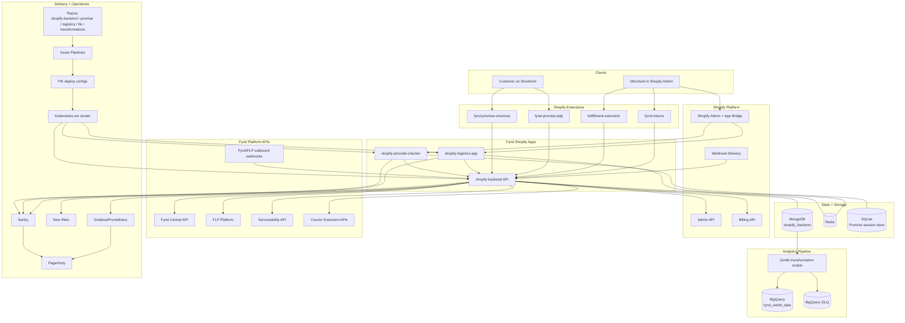
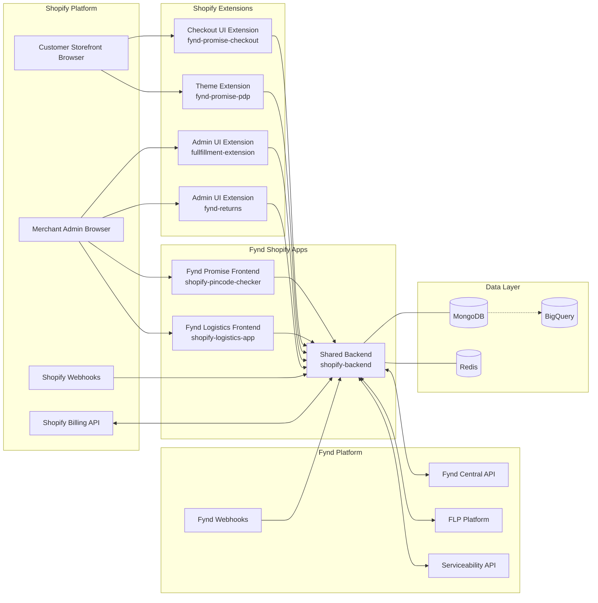
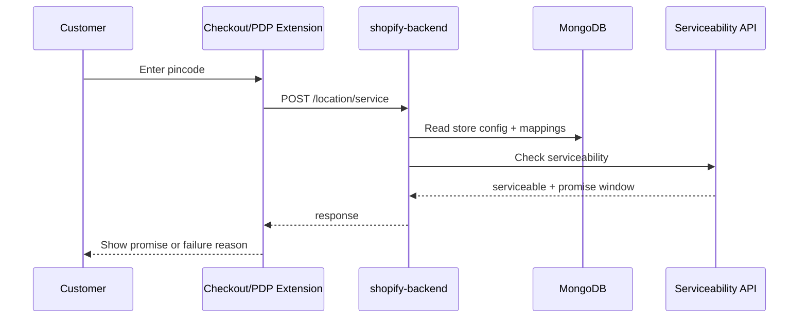
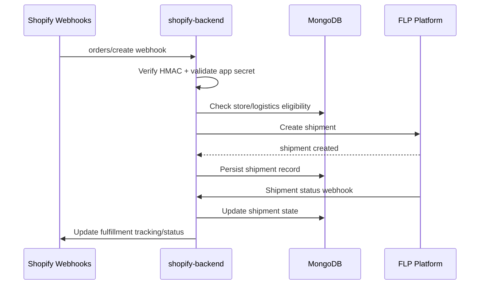

# Ecosystem Map

> **Owner:** Engineering — Fynd Extensions Team
> **Status:** Approved
> **Last Updated:** 2026-03-23

This page maps the full Fynd Shopify system: runtime components, deployment control plane, observability, and analytics pipeline.

---

## Whole System Diagram

---

## Runtime Component Map

---

## Repository to Runtime Ownership

| Repository | Deploys | Runtime Responsibility |
|-----------|---------|------------------------|
| `shopify-pincode-checker` | Promise embedded app + extension assets | Promise onboarding and customer-facing promise widgets |
| `shopify-logistics-app` | Logistics embedded app + admin extension assets | Logistics onboarding and manual fulfillment/returns actions |
| `shopify-backend` | Shared API + cron | Webhooks, fulfillment orchestration, billing, serviceability APIs |
| `fik-fynd-extensions` | Kubernetes manifests + env overlays | Environment-specific deployment and secret wiring |
| `transformations` | Zenith jobs | MongoDB -> BigQuery transformation and sync |

---

## Data Ownership Map

| Data | Owned By | Stored In |
|------|----------|-----------|
| Shopify sessions (Promise) | Promise app server | SQLite |
| Shopify sessions (Logistics) | Logistics app server | Redis |
| Merchant/store config | backend | MongoDB `stores` |
| Logistics setup | backend | MongoDB `logistics` + related collections |
| Shipments | backend | MongoDB `shipments` |
| Returns | backend | MongoDB `returns` |
| Billing/subscriptions | backend | MongoDB `subscriptions`, `transactions`, `orders` |
| Analytics tables | transformation pipeline | BigQuery `fynd_zenith_data.*` |

---

## Critical Runtime Flows

### Flow A: Customer Pincode Check

### Flow B: Order to Fulfillment

