# Ecosystem Map

> **Owner:** Engineering — Fynd Extensions Team
> **Status:** Approved
> **Last Updated:** 2026-03-23

This page shows how every component in the Fynd Shopify Ecosystem relates to each other.

---

## High-Level Architecture

```mermaid
graph TD
    subgraph "Shopify Platform"
        Admin["Shopify Admin<br/>(Merchant Browser)"]
        Storefront["Shopify Storefront<br/>(Customer Browser)"]
        ShopifyAPI["Shopify Admin API<br/>+ Billing API"]
        WebhookOut["Shopify Webhooks<br/>(orders, inventory, fulfillments...)"]
    end

    subgraph "Fynd Shopify Apps (Hosted)"
        PromiseApp["shopify-pincode-checker<br/>(Fynd Promise Frontend)<br/>React + Vite + Polaris"]
        LogisticsApp["shopify-logistics-app<br/>(Fynd Logistics Frontend)<br/>React + Vite + Polaris"]
        Backend["shopify-backend<br/>(Shared Node.js/Express)<br/>MongoDB + Redis"]
    end

    subgraph "Shopify Extensions"
        CheckoutExt["Checkout UI Extension<br/>(fynd-promise-checkout)<br/>Pincode checker at checkout"]
        PDPExt["Theme Extension<br/>(fynd-promise-pdp)<br/>Pincode checker on PDP"]
        OrderBlockExt["Admin UI Extension<br/>(fullfillment-extension)<br/>Order fulfillment block"]
        ReturnsExt["Admin UI Extension<br/>(fynd-returns)<br/>Returns block"]
    end

    subgraph "Fynd Platform"
        FyndCentral["Fynd Central API<br/>(Company, User, Sales Channel)"]
        FLP["FLP Platform<br/>(Fynd Logistics Platform)<br/>Shipment creation"]
        LogisticsExt["Fynd Logistics Extension API<br/>(Delivery Partners)"]
        ServiceabilityAPI["Serviceability API<br/>(Pincode lookup)"]
        FDKWebhooks["Fynd Platform Webhooks<br/>(Shipment status updates)"]
    end

    subgraph "Data"
        MongoDB[(MongoDB<br/>shopify_backend DB)]
        Redis[(Redis<br/>Session Cache)]
        BigQuery[(Google BigQuery<br/>fynd_zenith_data)]
        Zenith["Zenith Pipeline<br/>(transformations)"]
    end

    Admin -->|"OAuth install + embedded app"| PromiseApp
    Admin -->|"OAuth install + embedded app"| LogisticsApp
    Storefront -->|"Customer pincode check"| CheckoutExt
    Storefront -->|"Customer pincode check"| PDPExt

    PromiseApp -->|"REST /api/*"| Backend
    LogisticsApp -->|"REST /api/*"| Backend
    CheckoutExt -->|"POST /location/service"| Backend
    PDPExt -->|"POST /location/service"| Backend
    OrderBlockExt -->|"GET /logistics/fulfill/orders/:id/status"| Backend
    ReturnsExt -->|"POST /logistics/returns"| Backend

    Backend -->|"OAuth, Orders, Fulfillments,<br/>Billing API"| ShopifyAPI
    WebhookOut -->|"HMAC verified webhooks"| Backend

    Backend -->|"Company, User, Account<br/>management"| FyndCentral
    Backend -->|"Shipment creation<br/>+ tracking"| FLP
    Backend -->|"Delivery partner<br/>configuration"| LogisticsExt
    Backend -->|"Pincode serviceability<br/>lookup"| ServiceabilityAPI
    FDKWebhooks -->|"Shipment status<br/>update events"| Backend

    Backend --- MongoDB
    Backend --- Redis

    MongoDB -->|"Incremental sync via updatedAt"| Zenith
    Zenith --> BigQuery
```



---

## Repository → Deployment Map

| Repository | Deployed As | Environments |
|-----------|-------------|-------------|
| `shopify-pincode-checker` | `pincode-checker.extensions.*` | dev, SIT, UAT, prod |
| `shopify-logistics-app` | `shopify-logistics.extensions.*` | dev, UAT (fyndz6–z9), prod |
| `shopify-backend` | `shopify-backend.extensions.*` | dev, SIT, UAT, prod |

Full environment URLs → [Operations: Environments](../05-operations/environments.md)

---

## Data Ownership Map

| Data | Owned By | Stored In |
|------|----------|-----------|
| Shopify session tokens | shopify-backend | SQLite (Promise) / Redis (Logistics) |
| Merchant store config | shopify-backend | MongoDB `stores` collection |
| Logistics setup | shopify-backend | MongoDB `logistics` collection |
| Shipment records | shopify-backend | MongoDB `shipments` collection |
| Order records | shopify-backend | MongoDB `orders` collection |
| Return records | shopify-backend | MongoDB `returns` collection |
| Subscription records | shopify-backend | MongoDB `subscriptions` collection |
| Product mappings | shopify-backend | MongoDB `productMappings` collection |
| Store/location mappings | shopify-backend | MongoDB `storeMappings` collection |
| Courier partner definitions | shopify-backend | MongoDB `courierPartners` collection |
| Fynd company/account data | Fynd Central API | Fynd Platform DB (remote) |
| Shipment status | FLP Platform | FLP DB (remote) |
| Analytics | Zenith Pipeline | BigQuery `fynd_zenith_data` dataset |

---

## Request Flow: Customer Checks Pincode at Checkout

```
Customer types pincode in checkout
        ↓
Checkout UI Extension (fynd-promise-checkout)
  calls POST /location/service on shopify-backend
        ↓
shopify-backend looks up:
  1. Merchant config from MongoDB (deliveryPreference, promiseView)
  2. Warehouse location config from MongoDB (storeMappings)
  3. Calls Fynd Serviceability API with pincode + location
        ↓
Returns: { serviceable: true, promiseDate: "Mon–Wed" }
        ↓
Extension shows "Delivery by Mon–Wed" OR blocks checkout
```

## Request Flow: Order Created → Fulfillment

```
Customer places order
        ↓
Shopify fires orders/create webhook
        ↓
shopify-backend /webhook/store/:shop/orders/create
  (HMAC verified)
        ↓
shopifyWebhookService processes order:
  - Checks if logistics is enabled for shop
  - Finds fulfillment orders for the Shopify order
        ↓
fulfilmentService creates shipment:
  - Calls FLP Platform API to create shipment
  - Stores shipment record in MongoDB
        ↓
FLP fires shipment status webhook
        ↓
shopify-backend /webhook/flp
  - Updates Shopify fulfillment status
  - Updates MongoDB shipment record
```
