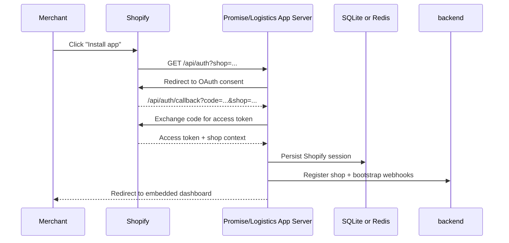
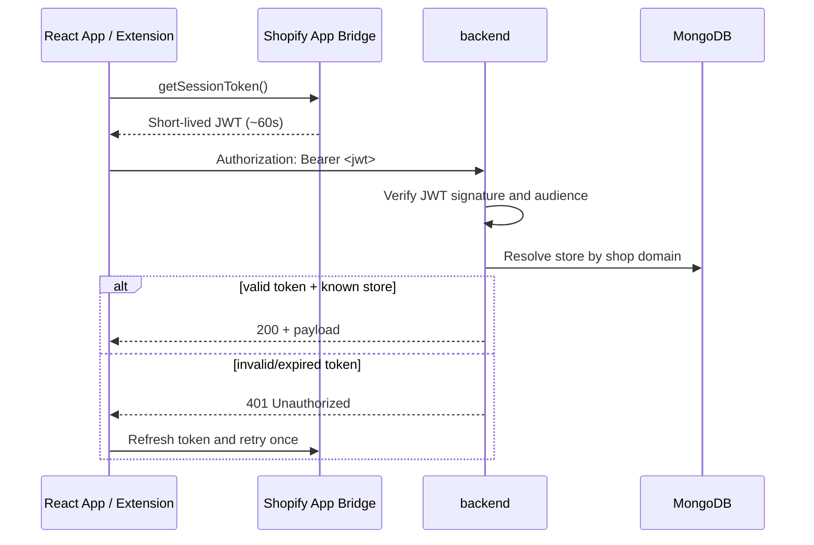
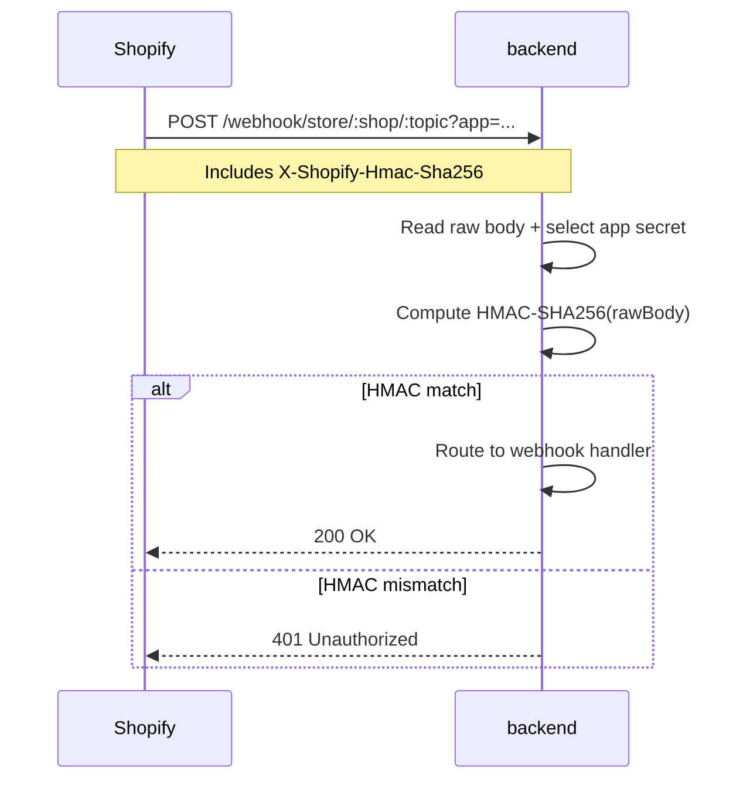
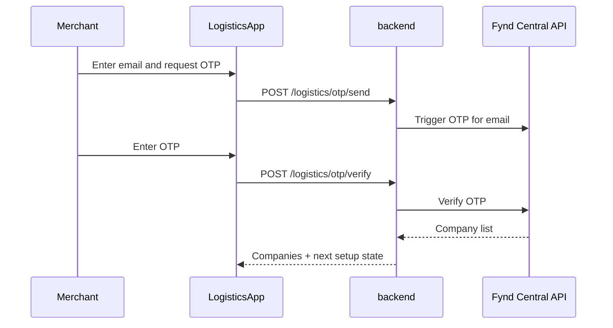

# Authentication

> **Owner:** Engineering — Fynd Extensions Team
> **Status:** Approved
> **Last Updated:** 2026-03-23

The Fynd Shopify ecosystem uses different authentication mechanisms per interaction type (install, browser API calls, webhooks, internal admin routes, and platform-to-platform calls).

---

## 1. Shopify OAuth (App Installation)

Used when a merchant installs either app.

### Sequence



### Session Storage

| App | Storage | Library | Notes |
|-----|---------|---------|-------|
| Promise | SQLite (`database.sqlite`) | `@shopify/shopify-app-session-storage-sqlite` | Simpler setup, weaker horizontal scale |
| Logistics | Redis | `@shopify/shopify-app-session-storage-redis` | Better for multi-replica app servers |

---

## 2. Session Token Auth (Frontend -> Backend)

Used for React frontend/API-extension calls to backend-proxied APIs.

### Sequence



### Token Validation Rules

1. Extract Bearer token from `Authorization` header.
2. Verify signature using app-specific API secret.
3. Validate `aud` (API key) against app type (`promise` or `logistics`).
4. Resolve `dest` shop domain and load store context.
5. Reject unknown store or invalid token with `401`.

### Two App Middleware Variants

- `createSessionAuth('promise')`
- `createSessionAuth('logistics')`

This keeps Promise and Logistics app credentials isolated.

---

## 3. Shopify Webhook HMAC Verification

Used for incoming Shopify webhooks.

### Sequence



### App Secret Selection

- `?app=fynd-promise` -> `shopify_app.promise_api_secret`
- `?app=fynd-logistics` -> `shopify_app.logistics_api_secret`

`crypto.timingSafeEqual` is used to avoid timing attacks.

---

## 4. Basic Auth (Internal/Admin Routes)

Used for admin/internal control routes.

```http
Authorization: Basic base64(username:password)
```

Credentials are read from environment (`BOLTIC_USERNAME`, `BOLTIC_PASSWORD`).

Typical protected surfaces:
- `/logistics/admin/*`
- `/logistics/admin/api/promise/*`
- `/map/mapInventories`
- `/webhook/extension/status`

---

## 5. OTP Verification (Logistics Account Linking)

Used when linking a Shopify merchant to an existing Fynd company.

### Sequence



Runtime constants:
- `OTP_LENGTH = 6`
- `RESEND_TIMER_DURATION = 10` seconds

---

## 6. Backend -> Fynd APIs

For Fynd platform APIs (Central/FLP/extension APIs), backend uses API key/secret or bearer admin token.

```http
x-api-key: <extension_api_key>
x-api-secret: <extension_api_secret>
```

or

```http
Authorization: Bearer <admin_token>
```

Admin token is fetched via panel OAuth client-credentials flow.

---

## 7. Failure and Retry Semantics

| Flow | Retry Behavior | Idempotency Consideration |
|------|----------------|---------------------------|
| Session token | frontend retries once after token refresh | Safe, read-mostly API calls |
| Shopify webhooks | Shopify retries failed deliveries | Handlers must handle duplicate deliveries |
| FLP/Fynd webhooks | Sender retries non-2xx | Shipment update processing must be idempotent |
| OTP send/verify | User-initiated retries | Throttle and expiration windows apply |

---

## Summary

| Mechanism | Used For | Trust Boundary |
|-----------|----------|----------------|
| OAuth | app install | Shopify ↔ app server |
| Session JWT | browser/extension -> backend | Shopify App Bridge token chain |
| HMAC | Shopify webhook authenticity | raw-body signature verification |
| Basic Auth | internal admin routes | internal operators/tools |
| OTP | account linking | Fynd identity verification |
| API key/secret | backend -> Fynd platform | server-to-server integration |
