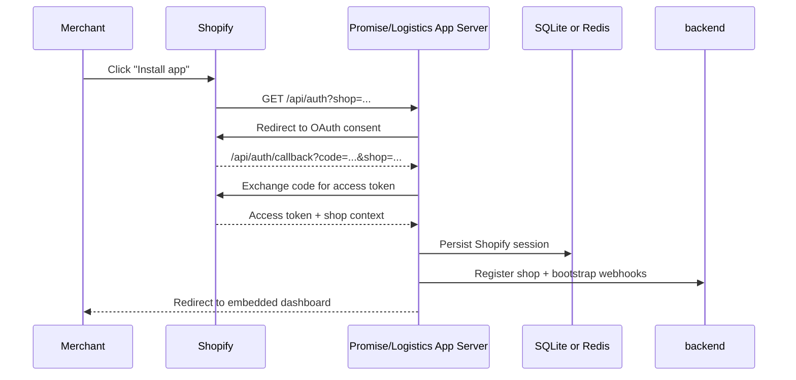
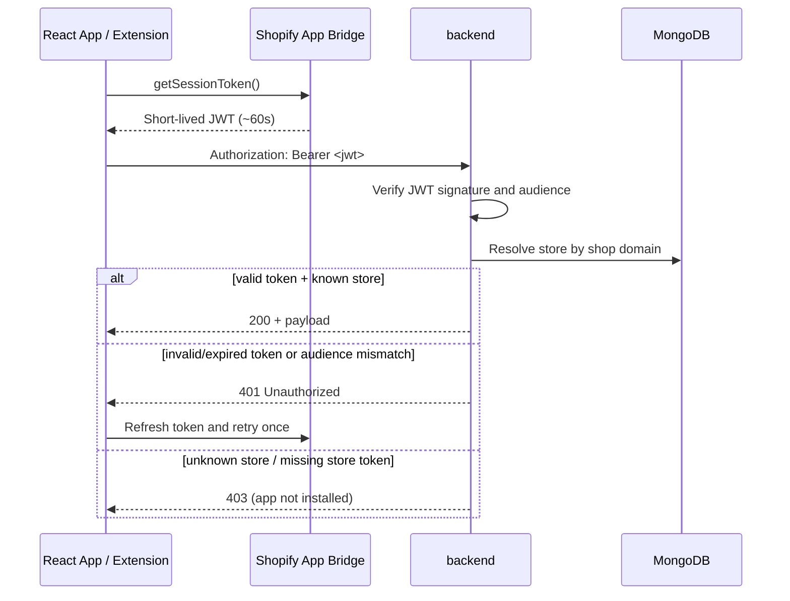
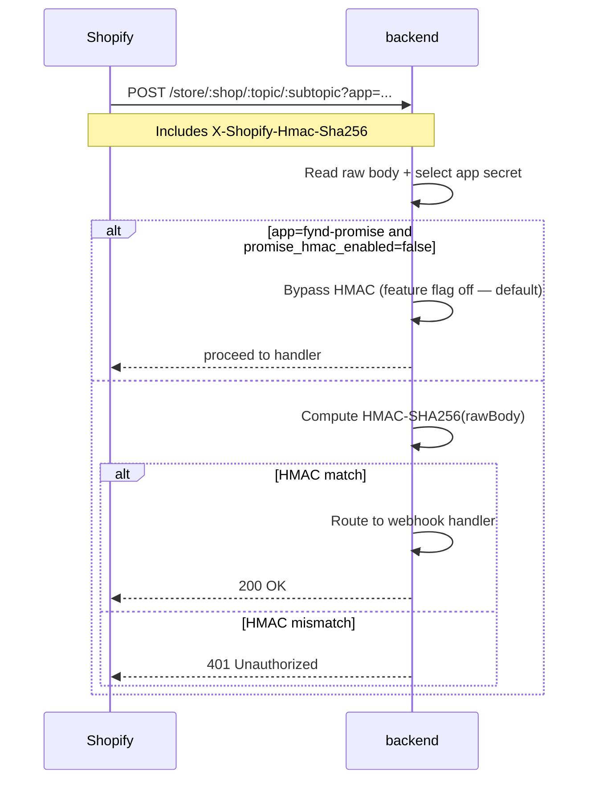
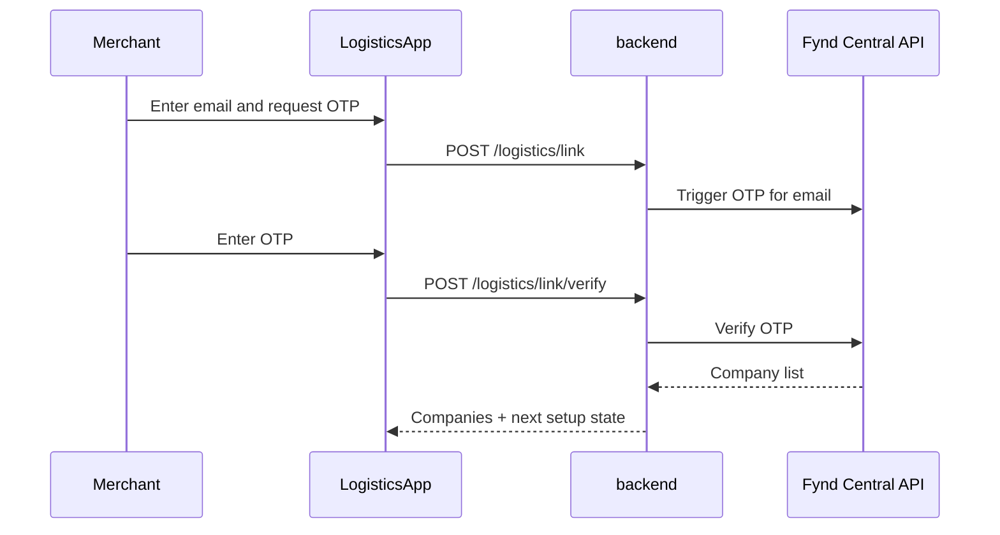

# Authentication

> **Owner:** Engineering — Fynd Extensions Team
> **Status:** Approved
> **Last Updated:** 2026-06-17

The Fynd Shopify ecosystem uses different authentication mechanisms per interaction type (install, browser API calls, webhooks, internal admin routes, and platform-to-platform calls).

---

## 1. Shopify OAuth (App Installation)

Used when a merchant installs either app.

### Sequence



### Session Storage

| App | Storage | Library | Notes |
|-----|---------|---------|-------|
| Promise | SQLite (`database.sqlite`) | `@shopify/shopify-app-session-storage-sqlite` | Simpler setup, weaker horizontal scale |
| Logistics | Redis | `@shopify/shopify-app-session-storage-redis` | Better for multi-replica app servers |

---

## 2. Session Token Auth (Frontend -> Backend)

Used for React frontend/API-extension calls to backend-proxied APIs.

### Sequence



### Token Validation Rules

1. Extract Bearer token from `Authorization` header.
2. Verify signature (HS256) using the app-specific API secret.
3. Validate `aud` (API key) against the app type (`promise` or `logistics`).
4. Resolve `dest` shop domain and load store context.
5. Missing/invalid/expired token, or audience mismatch → `401`. Unknown store, or store missing its token field → `403` ("app not installed").

### Two App Middleware Variants

`createSessionAuth(...)` in `middlewares/shopifySessionAuth.js` takes a **config object** `{ apiSecretKey, apiKeyConfig, tokenField, appLabel }` (not a string). It exports three middlewares:

- `shopifyLogisticsSessionAuth` — guards on the store's `shopifyToken` field
- `shopifyPromiseSessionAuth` — guards on the store's `promise_shopifyToken` field
- `shopifySessionAuth` — an alias for the logistics variant

This keeps Promise and Logistics app credentials isolated.

---

## 3. Shopify Webhook HMAC Verification

Used for incoming Shopify webhooks.

### Sequence



### Registered Route

The Shopify store webhook route is `POST /store/:shop/:topic/:subtopic` (three path segments). There is **no** two-segment `/store/:shop/:topic` route, so e.g. `orders/create` arrives as `topic=orders`, `subtopic=create`.

### App Secret Selection

- `?app=fynd-logistics` -> `shopify_app.logistics_api_secret` (fail-closed: missing secret → 500)
- `?app=fynd-promise` or no `app` param -> `shopify_app.promise_api_secret`

`crypto.timingSafeEqual` is used to avoid timing attacks.

### Promise HMAC Feature Flag (security-relevant)

> **Known issue / important:** In `middlewares/shopifyHmacAuth.js`, when `appName !== 'fynd-logistics'` (i.e. Promise or no `app` param) and the flag `promise_hmac_enabled` (env `PROMISE_SHOPIFY_HMAC_ENABLED`, **default `false`**) is off, HMAC verification is **bypassed** entirely (the middleware calls `next()`). This is the default state. Only `fynd-logistics` webhooks are fail-closed and always verified. Promise webhooks are not authenticated until `PROMISE_SHOPIFY_HMAC_ENABLED=true` is set in the environment.

---

## 4. Basic Auth (Internal Routes)

Used for a small set of internal/server-to-server routes.

```http
Authorization: Basic base64(username:password)
```

Credentials are read from environment (`BOLTIC_USERNAME`, `BOLTIC_PASSWORD`).

Basic Auth protects **only** these two surfaces:
- `POST /map/mapInventories` (`routes/sync.js`)
- `POST /webhook/extension/status` (`routes/webhook.js`)

> **Note:** The admin dashboard is **not** Basic Auth. `/logistics/admin/*` uses an OTP + session + CSRF + origin-check system — see Section 8 below.

---

## 5. OTP Verification (Logistics Account Linking & Email)

Used when linking a Shopify merchant to an existing Fynd company, or verifying an email when creating a new company.

> **Note:** The routes `/logistics/otp/send` and `/logistics/otp/verify` are **not mounted** (`routes/otpRoutes.js` is dead code). The real endpoints are below.

There are two distinct OTP flows, both under `/logistics` (`routes/logisticsRoutes.js`):

**Account-linking OTP** (link an existing Fynd company):
- `POST /logistics/link`
- `POST /logistics/link/verify`

**Create-new email OTP** (verify email for a new company):
- `POST /logistics/email/send-otp`
- `POST /logistics/email/verify-otp`
- `GET /logistics/email/verification-status`
- `POST /logistics/email/reset-verification`

### Sequence (account linking)



Runtime constants:
- `OTP_LENGTH = 6`
- `RESEND_TIMER_DURATION = 10` seconds

---

## 6. Backend -> Fynd APIs

For Fynd platform APIs (Central/FLP/extension APIs), backend uses API key/secret or bearer admin token.

```http
x-api-key: <extension_api_key>
x-api-secret: <extension_api_secret>
```

or

```http
Authorization: Bearer <admin_token>
```

Admin token is fetched via panel OAuth client-credentials flow.

---

## 7. Failure and Retry Semantics

| Flow | Retry Behavior | Idempotency Consideration |
|------|----------------|---------------------------|
| Session token | frontend retries once after token refresh | Safe, read-mostly API calls |
| Shopify webhooks | Shopify retries failed deliveries | Handlers must handle duplicate deliveries |
| FLP/Fynd webhooks | Sender retries non-2xx | Shipment update processing must be idempotent |
| OTP send/verify | User-initiated retries | Throttle and expiration windows apply |

---

## 8. Admin Dashboard Auth (OTP + Session + CSRF)

The `/logistics/admin` dashboard uses an OTP + server-side session + CSRF + origin-check system (it is **not** Basic Auth).

- Middleware: `middlewares/adminAuth.js` — `requireAdminSession`, `enforceAdminOrigin`, `enforceCsrfToken`, `auditAdminAction`
- Controllers: `controllers/adminAuthController.js`, `controllers/services/adminAuthService.js`
- Auth routes:
  - `POST /logistics/admin/api/auth/request-otp`
  - `POST /logistics/admin/api/auth/verify-otp`
  - `POST /logistics/admin/api/auth/logout`
  - `GET /logistics/admin/api/auth/session`
- Config keys (`admin_auth.*`): `ADMIN_AUTH_STRICT`, `ADMIN_ALLOWED_EMAILS`, `ADMIN_OTP_TTL_SECONDS`, `ADMIN_OTP_MAX_ATTEMPTS_PER_CHALLENGE`, `ADMIN_SESSION_TTL_SECONDS`

All `/logistics/admin/api/*` routes (other than the auth request/verify endpoints) are gated by `requireAdminSession` + `enforceAdminOrigin` + `enforceCsrfToken`.

---

## Summary

| Mechanism | Used For | Trust Boundary |
|-----------|----------|----------------|
| OAuth | app install | Shopify ↔ app server |
| Session JWT | browser/extension -> backend | Shopify App Bridge token chain |
| HMAC | Shopify webhook authenticity (logistics fail-closed; promise bypassed by default) | raw-body signature verification |
| Basic Auth | `/map/mapInventories`, `/webhook/extension/status` only | internal operators/tools |
| OTP (merchant) | account linking / email verification | Fynd identity verification |
| Admin OTP + session + CSRF | `/logistics/admin` dashboard | internal operators |
| API key/secret | backend -> Fynd platform | server-to-server integration |
