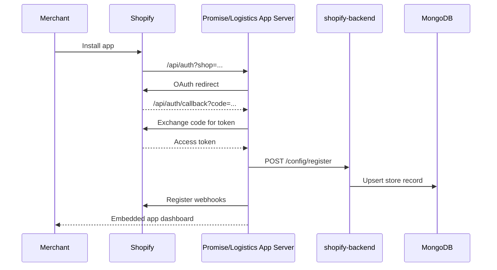
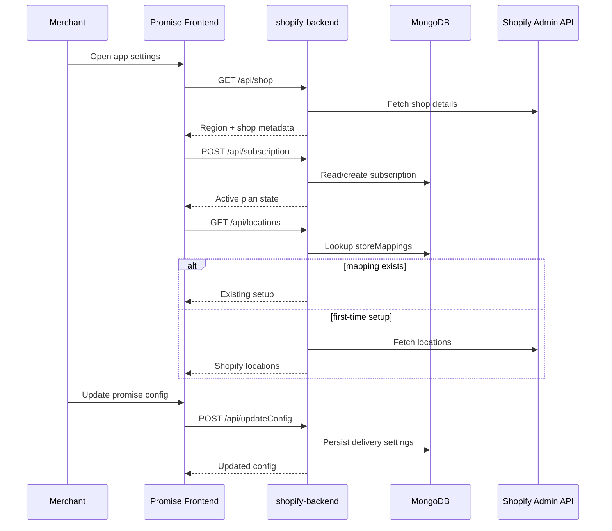
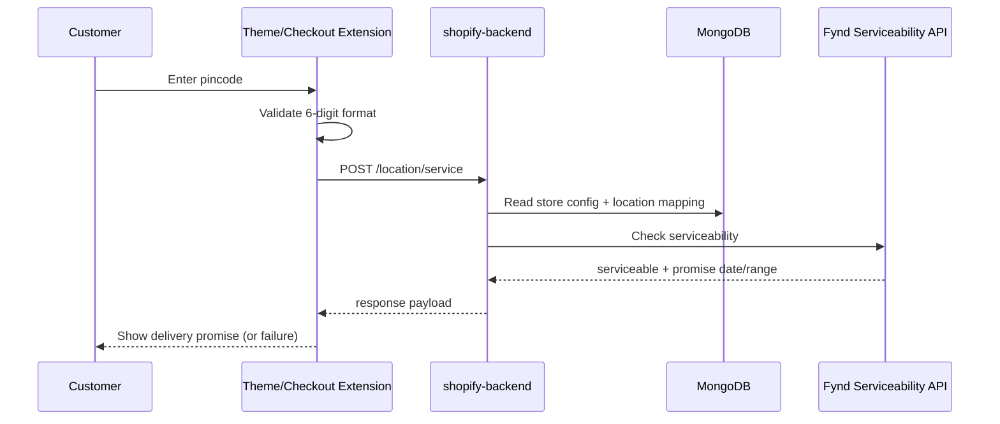
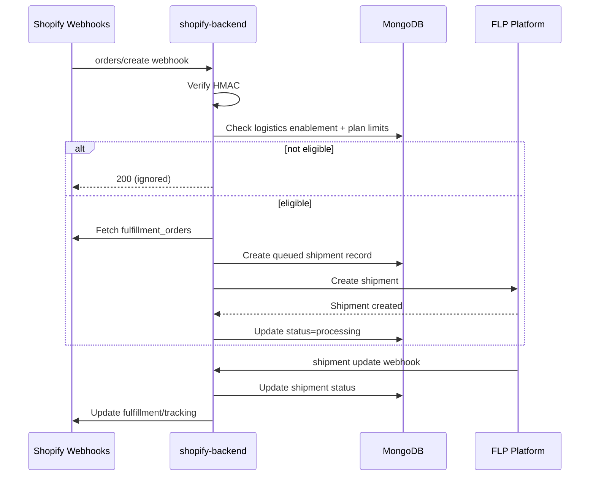
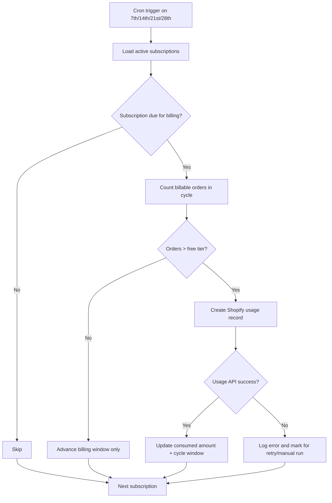
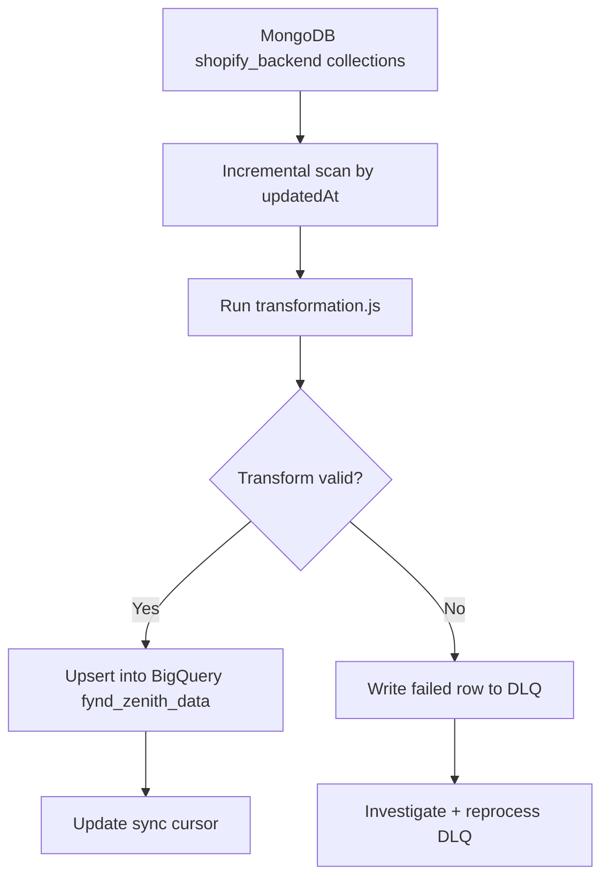

# End-to-End Data Flow

> **Owner:** Engineering — Fynd Extensions Team
> **Status:** Approved
> **Last Updated:** 2026-03-23

This document traces the main lifecycle flows across Shopify, Fynd services, and internal data stores.

---

## Flow 1: App Installation (OAuth + Bootstrap)

### Notes

- Region gating is applied during bootstrap (`country_code === 'IN'`).
- Webhooks are registered per app (`?app=fynd-promise` or `?app=fynd-logistics`).

---

## Flow 2: Merchant Configures Promise App

---

## Flow 3: Customer Checks Pincode (PDP/Checkout)

### Failure Path

- Invalid pincode -> 4xx validation response (no external API call).
- Serviceability timeout/error -> fallback message shown to customer.

---

## Flow 4: Order Creation to Fulfillment

### Idempotency and Retries

- Duplicate webhook deliveries are expected; handlers must be idempotent.
- FLP updates are processed as status transitions; stale transitions should be ignored.

---

## Flow 5: Billing Cycle

### Operational Notes

- Manual trigger: `GET /config/billingCron`.
- Billing correctness depends on `orders.is_billed` and cycle window calculations.

---

## Flow 6: MongoDB to BigQuery (Zenith)

### Current Scope

- Synced collections include `stores`, `orders`, `subscriptions`, `productMappings`, `storeMappings`, `courierPartners`.
- `shipments` and `returns` are not yet synced (tracked in known gaps).

---

## Cross-Flow Invariants

1. `shop` (`*.myshopify.com`) is the primary tenant key across flows.
2. HMAC/session validation is enforced before business logic.
3. Write paths are MongoDB-first; analytics is eventual via pipeline sync.
4. All webhook and cron handlers should be safe to replay.
