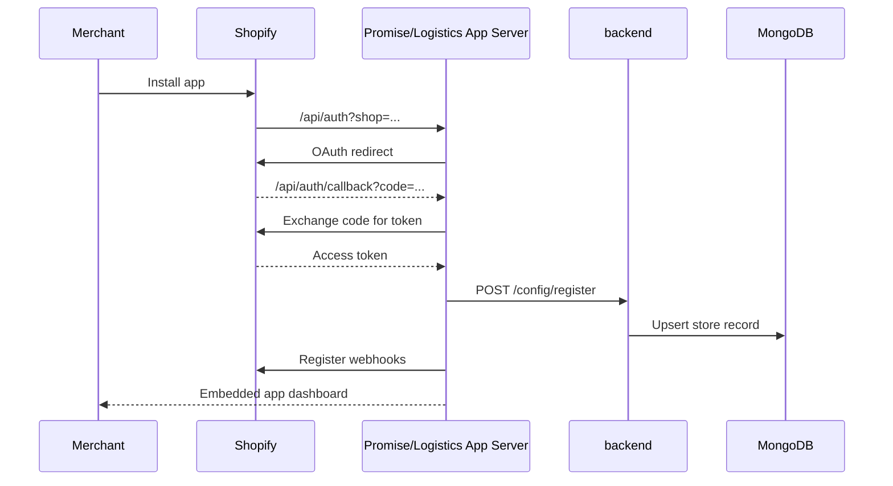
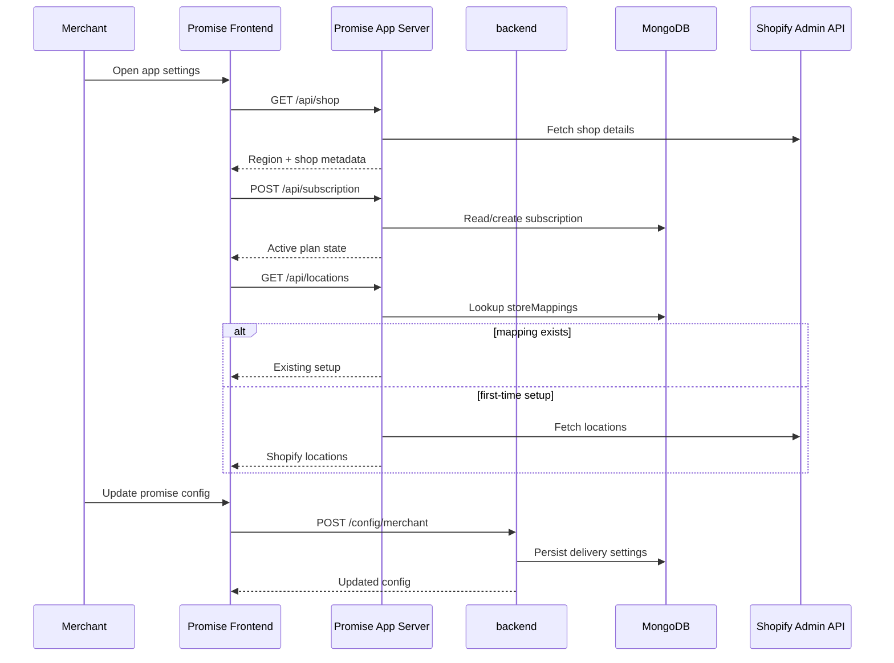
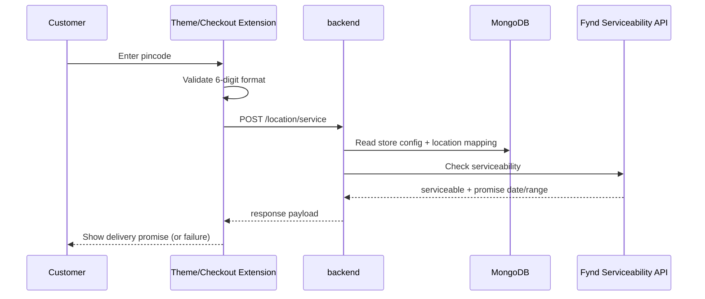
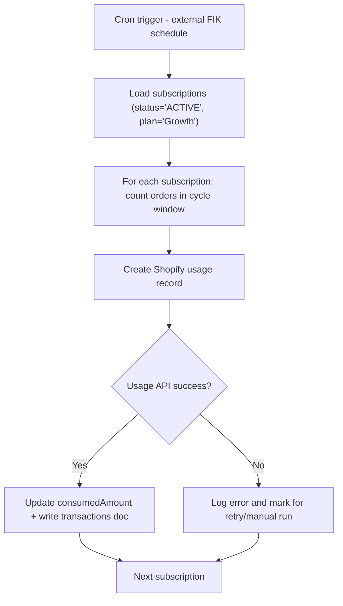
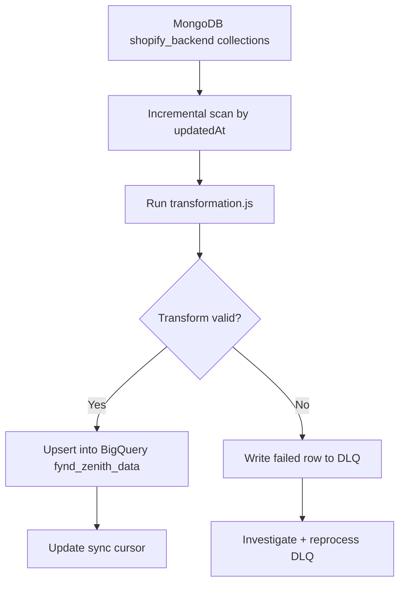
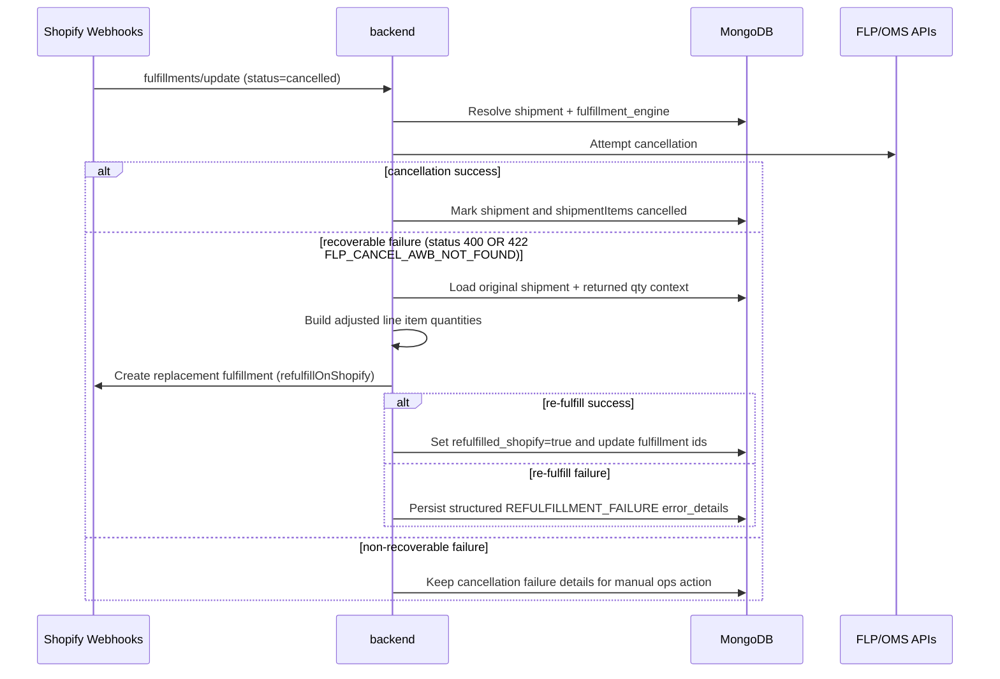

# End-to-End Data Flow

> **Owner:** Engineering — Fynd Extensions Team
> **Status:** Approved
> **Last Updated:** 2026-06-17

This document traces the main lifecycle flows across Shopify, Fynd services, and internal data stores.

---

## Flow 1: App Installation (OAuth + Bootstrap)



### Notes

- Region gating is applied during bootstrap (`country_code === 'IN'`).
- Webhooks are registered per app (`?app=fynd-promise` or `?app=fynd-logistics`).

---

## Flow 2: Merchant Configures Promise App



> **Note:** `/api/shop`, `/api/subscription`, `/api/locations`, and `/api/updateConfig` are **app-server** routes (in the Promise/Logistics web apps), not in `shopify-backend`. The `shopify-backend` config endpoints are: `GET`/`POST /config/merchant`, `POST /config/subscription`, `POST /config/fyndPromise`, `GET /config/shops` (plus `POST /config/register` used during install).

---

## Flow 3: Customer Checks Pincode (PDP/Checkout)



### Request Body

Per its Swagger definition (`routes/serviceability.js`), `POST /location/service` takes:

```json
{ "pincode": "000000", "shopifyProductId": 987654321, "shopifyShop": "my-shop-name" }
```

(All three fields are required.)

### Failure Path

- Invalid pincode -> 4xx validation response (no external API call).
- Serviceability timeout/error -> fallback message shown to customer.

---

## Flow 4: Order Creation to Fulfillment


### Dual Workflow on `orders/create`

The same `orders/create` webhook serves both billing (promise) and fulfillment (logistics). In `controllers/webhook.controller.js`, the handler calls:

- `subscription.handleOrderCreated(...)` — promise/billing path, gated by `shouldRunPromiseWorkflows` (`!appName || appName === 'fynd-promise'`)
- `processShopifyOrder(...)` — logistics path, gated by `shouldRunLogisticsWorkflows` (`appName === 'fynd-logistics'`) **and** the presence of a `logisticsData` document for the shop

### Idempotency and Retries

- Duplicate webhook deliveries are expected; handlers must be idempotent.
- FLP updates are processed as status transitions; stale transitions should be ignored.

---

## Flow 5: Billing Cycle



### Operational Notes

- Manual trigger: `GET /config/billingCron`.
- The cron updates `consumedAmount` on the subscription and writes a `transactions` document. It does **not** apply a free-tier deduction and does **not** advance the billing-cycle window.
- The order-count field is `isBilled` (camelCase) on the orders model, but the cron does **not** read or set `isBilled`.

> **Known issue:** The cron query (`controllers/billing.js`) filters `subscriptions.find({ status: 'ACTIVE', plan: 'Growth' })`, but the model status enum is lowercase (`active`/`cancelled`/`expired`/`uninstalled`), so the uppercase `'ACTIVE'` matches nothing. The order count also uses `orders.find({ storeId, createdAt })`, but the `orders` model has no `storeId` field.

---

## Flow 6: MongoDB to BigQuery (Zenith)

> **External pipeline:** This flow is **out of repo** — there is no BigQuery or sync code in `shopify-backend`. The checked-out `transformations` repo did not contain `shopify_backend` transformation files during the 2026-06-17 audit, so the collection names below should be treated as historical/target scope until the active pipeline location is confirmed.



### Current Scope

- Previously documented collections include `stores`, `orders`, `subscriptions`, `productMappings`, `storeMappings`, `courierPartners`.
- `shipments`, `returns`, and logistics-specific detail collections are not covered by that historical set (tracked in known gaps).

---

## Cross-Flow Invariants

1. `shop` (`*.myshopify.com`) is the primary tenant key across flows.
2. HMAC/session validation is enforced before business logic.
3. Write paths are MongoDB-first; analytics is eventual via pipeline sync.
4. All webhook and cron handlers should be safe to replay.

---

## Flow 7: Fulfillment Cancellation and Shopify Re-Fulfillment Recovery


