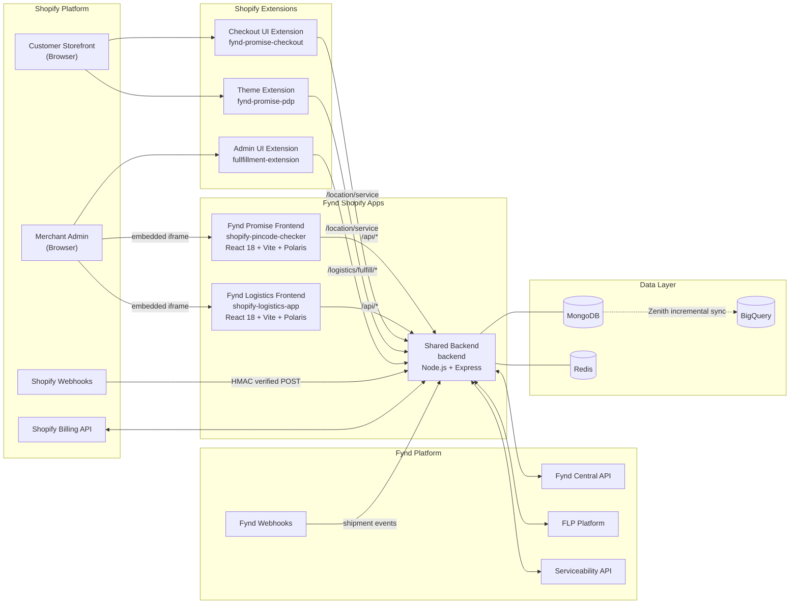

# System Overview

> **Owner:** Engineering — Fynd Extensions Team
> **Status:** Approved
> **Last Updated:** 2026-03-23

This document provides the high-level system architecture of the Fynd Shopify Ecosystem.

---

## Component Map



---

## Technology Stack

### shopify-backend

| Layer | Technology |
|-------|-----------|
| Runtime | Node.js >=18 (Node 20 LTS recommended) |
| Framework | Express.js (via `fit` — Fynd's internal framework) |
| Database | MongoDB 6 with Mongoose ODM |
| Cache / Session | Redis 7 |
| Config | Convict (schema-based env validation) |
| Logging | Winston (JSON, structured) |
| Error Tracking | Sentry |
| APM | New Relic (optional) |
| Metrics | Prometheus (`prom-file-client`) |
| Shopify SDK | `@shopify/shopify-api` |
| Fynd SDK | `@gofynd/fdk-client-javascript`, `fdk-extension-javascript` |
| Validation | Joi |
| API Docs | Swagger UI + swagger-jsdoc |
| Testing | Jest 29, Supertest |

### shopify-pincode-checker (web server)

| Layer | Technology |
|-------|-----------|
| Runtime | Node.js >=16.13 (Node 20 LTS recommended) |
| Framework | Express.js |
| Session Storage | SQLite (via `@shopify/shopify-app-session-storage-sqlite`) |
| Shopify Integration | `@shopify/shopify-app-express` |
| Config | Convict |
| Logging | Winston |
| Error Tracking | Sentry |

### shopify-pincode-checker (frontend)

| Layer | Technology |
|-------|-----------|
| Framework | React 18 |
| Build Tool | Vite 6 |
| UI Components | Shopify Polaris 13 |
| Shopify Integration | App Bridge 3 + app-bridge-react |
| Routing | React Router DOM 6 |
| Data Fetching | React Query 3 |
| i18n | i18next 23 |

### shopify-logistics-app (frontend)

Same as Promise app, with additions:

| Layer | Technology |
|-------|-----------|
| State Management | Jotai 2 (atomic state) |
| API Client | Custom `useLogisticsApi` hook with session token retry |

---

## Deployment Architecture

All three services are deployed as Docker containers on a Kubernetes cluster managed by **FIK** (Fynd Infrastructure Kit).

```
FIK (Helm-like Kubernetes framework)
├── shopify-pincode-checker → pincode-checker.extensions.*
│   └── Deployment (Node.js Express + served React SPA)
├── shopify-logistics-app → shopify-logistics.extensions.*
│   └── Deployment (Node.js Express + served React SPA)
└── shopify-backend → shopify-backend.extensions.*
    ├── Deployment (Express API server)
    └── CronJob (billing_trigger — runs on 7th, 14th, 21st, 28th)
```

**Resource defaults:**
- CPU request: 100m, limit: 500m
- Memory request: 400Mi, limit: 1000Mi

For full deployment details → [Infrastructure](../05-operations/infrastructure.md)

---

## Data Flow Summary

### On App Install (OAuth)
1. Merchant clicks Install
2. Shopify redirects to `/api/auth`
3. OAuth completes → access token stored in session DB
4. `fyndIntegration.js` fires:
   - Registers the store with `shopify-backend`
   - Creates all required Shopify webhooks pointing to `shopify-backend`

### On API Request (from merchant's browser)
1. React app calls `/api/*` via `useAuthenticatedFetch` or `useLogisticsApi`
2. Hook attaches Shopify session token as `Authorization: Bearer <jwt>`
3. App's Express server validates the token
4. Request proxied to `shopify-backend` with `x-api-key` header

### On Shopify Webhook
1. Shopify fires POST to `shopify-backend/webhook/store/:shop/:topic`
2. `shopifyHmacAuth` middleware verifies HMAC signature
3. `webhook.controller.js` routes to appropriate handler
4. Business logic updates MongoDB, may call Fynd APIs

### On Fynd Platform Webhook
1. FLP fires POST to `shopify-backend/webhook/flp/shipment/update/:companyId`
2. `webhook.controller.js` routes to `shipmentService`
3. Shopify fulfillment status updated via Admin API
4. MongoDB shipment record updated
