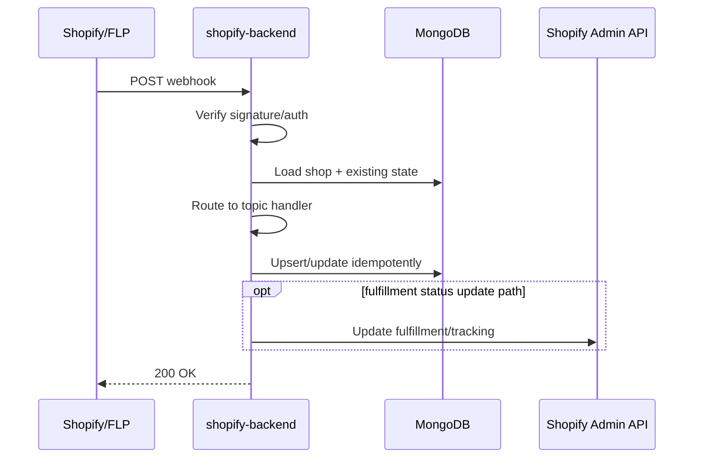

# Webhooks Reference

> **Owner:** Engineering — Fynd Extensions Team
> **Status:** Approved
> **Last Updated:** 2026-03-23

All webhooks registered and consumed by the Fynd Shopify Ecosystem.

---

## Webhook Processing Sequence



---

## Shopify → shopify-backend (Inbound)

These webhooks are registered by `fyndIntegration.js` during app installation.

### Registration URL Pattern

```
https://shopify-backend.extensions.fynd.com/webhook/store/{shop}/{topic}?app={appName}
```

The `?app=` query param tells the HMAC middleware which API secret to use for verification.

### Promise App Webhooks

Registered when `shopify-pincode-checker` is installed:

| Topic | URL | Purpose |
|-------|-----|---------|
| `inventory_levels/update` | `/webhook/store/{shop}/inventory_levels/update?app=promise` | Sync inventory changes to Fynd |
| `locations/create` | `/webhook/store/{shop}/locations/create?app=promise` | Create corresponding Fynd location |
| `locations/update` | `/webhook/store/{shop}/locations/update?app=promise` | Update Fynd location |
| `orders/create` | `/webhook/store/{shop}/orders/create?app=promise` | Track order for billing |
| `app/uninstalled` | `/webhook/store/{shop}/app/uninstalled?app=promise` | Clean up store data |
| `app_subscriptions/update` | `/webhook/store/{shop}/app_subscriptions/update?app=promise` | Handle subscription changes |
| `products/update` | `/webhook/store/{shop}/products/update?app=promise` | Sync product to Fynd |

### Logistics App Webhooks

Registered when `shopify-logistics-app` is installed — includes all Promise webhooks plus:

| Topic | URL | Purpose |
|-------|-----|---------|
| `fulfillments/create` | `/webhook/store/{shop}/fulfillments/create?app=logistics` | Track new fulfillments |
| `fulfillments/update` | `/webhook/store/{shop}/fulfillments/update?app=logistics` | Track fulfillment status changes |
| `returns/cancel` *(GraphQL)* | `/webhook/store/{shop}/returns/cancel?app=logistics` | Handle return cancellations |

### GDPR Webhooks

Registered in `shopify.app.toml` (not via code, configured declaratively):

| Topic | URL | Purpose |
|-------|-----|---------|
| `customers/data_request` | `/webhook/store/gdpr/{shop}/customers/data_request` | GDPR data request |
| `customers/redact` | `/webhook/store/gdpr/{shop}/customers/redact` | GDPR customer data deletion |
| `shop/redact` | `/webhook/store/gdpr/{shop}/shop/redact` | GDPR shop data deletion |

### Shopify Webhook API Version Notes

Webhook API version is read from each app TOML and may differ by app/environment config:

| Config File | `api_version` |
|-------------|---------------|
| `shopify-pincode-checker/shopify.app.toml` | `2024-07` |
| `shopify-pincode-checker/shopify.app.pincode-serviceability-test.toml` | `2024-10` |
| `shopify-logistics-app/shopify.app.fynd-logistics-uat.toml` | `2026-01` |
| `shopify-logistics-app/shopify.app.fynd-logistics.toml` | `2025-04` |

---

## Shopify Webhook Verification

All inbound Shopify webhooks are verified using HMAC-SHA256:

```
X-Shopify-Hmac-Sha256: <base64-encoded-hmac>
```

Verification in `middlewares/shopifyHmacAuth.js`:
```javascript
const hmac = createHmac('sha256', appSecret)
  .update(rawBody)
  .digest('base64')

// Timing-safe comparison
if (!timingSafeEqual(Buffer.from(hmac), Buffer.from(receivedHmac))) {
  return res.status(401).json({ error: 'Invalid HMAC' })
}
```

**App-specific secret selection:**
- `?app=logistics` → `config.get('shopify_app.logistics_api_secret')`
- `?app=promise` → `config.get('shopify_app.promise_api_secret')`

---

## FLP Platform → shopify-backend (Inbound)

FLP fires shipment status updates to:

```
POST https://shopify-backend.extensions.fynd.com/webhook/flp
```

### Event Types Handled

| Event Name | Description |
|-----------|-------------|
| `application/shipment/update/v1` | Shipment status changed |

### Payload Structure

```json
{
  "event": "application/shipment/update/v1",
  "company_id": 123,
  "application_id": "app-id",
  "payload": {
    "shipment": {
      "id": "FY-SHIP-12345",
      "order_id": "FY-ORDER-789",
      "application_id": "app-id",
      "status": "delivered",
      "awb_no": "1234567890",
      "dp_name": "Delhivery",
      "tracking_url": "https://track.delhivery.com/...",
      "bags": [...]
    }
  }
}
```

### Status Mapping (FLP → Shopify)

| FLP Status | Shopify Fulfillment Status | MongoDB Shipment Status |
|-----------|--------------------------|------------------------|
| `bag_picked` | `in_transit` | `processing` |
| `out_for_delivery` | `in_transit` | `processing` |
| `delivered` | `success` | `fulfilled` |
| `rto_initiated` | `failure` | `error` |
| `cancelled` | `cancelled` | `cancelled` |

---

## Fynd Platform → shopify-backend (FDK Extension Handler)

The FDK extension webhook handler (mounted at `/api/v1/fynd/webhooks`) handles Fynd platform webhooks registered via the FDK.

### Fynd Platform Webhook Registration

During app setup, the backend registers webhooks with Fynd Central via the FDK extension system. These webhooks fire when events happen on the Fynd platform that affect the merchant's integration.

---

## Shopify Extension Status → shopify-backend (Inbound)

```
POST /webhook/extension/status
Authorization: Basic <credentials>
```

Receives extension enable/disable status updates from Fynd's extension management system.

---

## Webhook Delivery Guarantees

**Shopify webhooks:**
- Shopify retries failed webhooks with exponential backoff
- Max 19 retries over 48 hours
- If all retries fail, Shopify marks the webhook as failed

**FLP webhooks:**
- FLP retries on non-200 responses
- Idempotency: shipment updates are deduplicated by `fulfillment_order_id`

**Best practice:** Webhook handlers should be idempotent — processing the same event twice should not cause duplicate side effects.
