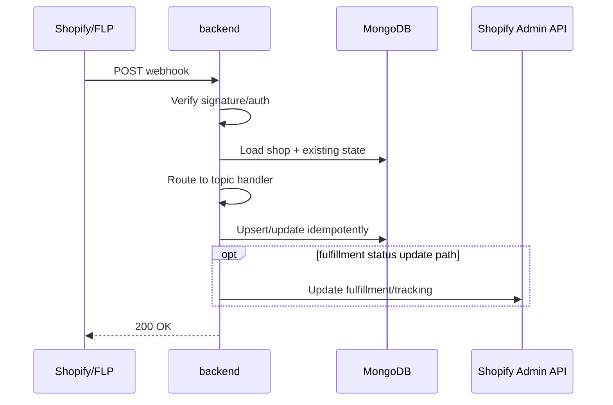

# Webhooks Reference

> **Owner:** Engineering — Fynd Extensions Team
> **Status:** Approved
> **Last Updated:** 2026-06-17

All webhooks registered and consumed by the Fynd Shopify Ecosystem.

---

## Webhook Processing Sequence



---

## Shopify → shopify-backend (Inbound)

These webhooks are registered by `fyndIntegration.js` during app installation.

### Registration URL Pattern

```
https://shopify-backend.extensions.fynd.com/webhook/store/{shop}/{topic}/{subtopic}?app={appName}
```

The backend only mounts the 3-segment `:shop/:topic/:subtopic` route, so the `{subtopic}` segment is effectively required. The topic is reconstructed server-side as `{topic}/{subtopic}` (e.g. `orders` + `create` → `orders/create`).

The `?app=` query param tells the HMAC middleware which API secret to use for verification.

### Promise App Webhooks

Registered when `shopify-pincode-checker` is installed:

| Topic | URL | Purpose |
|-------|-----|---------|
| `inventory_levels/update` | `/webhook/store/{shop}/inventory_levels/update?app=fynd-promise` | Sync inventory changes to Fynd |
| `locations/create` | `/webhook/store/{shop}/locations/create?app=fynd-promise` | Create corresponding Fynd location |
| `locations/update` | `/webhook/store/{shop}/locations/update?app=fynd-promise` | Update Fynd location |
| `orders/create` | `/webhook/store/{shop}/orders/create?app=fynd-promise` | Track order for billing |
| `app/uninstalled` | `/webhook/store/{shop}/app/uninstalled?app=fynd-promise` | Clean up store data |
| `app_subscriptions/update` | `/webhook/store/{shop}/app_subscriptions/update?app=fynd-promise` | Handle subscription changes |
| `products/update` | `/webhook/store/{shop}/products/update?app=fynd-promise` | Sync product to Fynd |

### Logistics App Webhooks

Registered when `shopify-logistics-app` is installed — includes all Promise webhooks plus:

| Topic | URL | Purpose |
|-------|-----|---------|
| `fulfillments/create` | `/webhook/store/{shop}/fulfillments/create?app=fynd-logistics` | Track new fulfillments |
| `fulfillments/update` | `/webhook/store/{shop}/fulfillments/update?app=fynd-logistics` | Handle fulfillment cancellation |
| `returns/request` *(GraphQL)* | `/webhook/store/{shop}/returns/request?app=fynd-logistics` | Handle customer return requests |
| `returns/approve` *(GraphQL)* | `/webhook/store/{shop}/returns/approve?app=fynd-logistics` | Handle return approvals |
| `returns/decline` *(GraphQL)* | `/webhook/store/{shop}/returns/decline?app=fynd-logistics` | Handle return declines |
| `returns/cancel` *(GraphQL)* | `/webhook/store/{shop}/returns/cancel?app=fynd-logistics` | Handle return cancellations |

### GDPR Webhooks

Registered in `shopify.app.toml` (not via code, configured declaratively):

| Topic | URL | Purpose |
|-------|-----|---------|
| `customers/data_request` | `/webhook/store/gdpr/{shop}/customers/data_request` | GDPR data request |
| `customers/redact` | `/webhook/store/gdpr/{shop}/customers/redact` | GDPR customer data deletion |
| `shop/redact` | `/webhook/store/gdpr/{shop}/shop/redact` | GDPR shop data deletion |

### Shopify Webhook API Version Notes

Webhook API version is read from each app TOML and may differ by app/environment config:

| Config File | `api_version` |
|-------------|---------------|
| `shopify-pincode-checker/shopify.app.toml` | `2024-07` |
| `shopify-pincode-checker/shopify.app.pincode-serviceability-test.toml` | `2024-10` |
| `shopify-logistics-app/shopify.app.fynd-logistics-uat.toml` | `2026-01` |
| `shopify-logistics-app/shopify.app.fynd-logistics-prod.toml` | `2026-01` |

---

## Shopify Webhook Verification

All inbound Shopify webhooks are verified using HMAC-SHA256:

```
X-Shopify-Hmac-Sha256: <base64-encoded-hmac>
```

Verification in `middlewares/shopifyHmacAuth.js`:
```javascript
const hmac = createHmac('sha256', appSecret)
  .update(rawBody)
  .digest('base64')

// Timing-safe comparison
if (!timingSafeEqual(Buffer.from(hmac), Buffer.from(receivedHmac))) {
  return res.status(401).json({ error: 'Invalid HMAC' })
}
```

**App-specific secret selection:**
- `?app=fynd-logistics` → `config.get('shopify_app.logistics_api_secret')`. **Fail-closed:** if the secret is missing, the request is rejected with `500`.
- `?app=fynd-promise` (or missing legacy value) → `config.get('shopify_app.promise_api_secret')`, but **only when `promise_hmac_enabled` is ON**.

> **Promise HMAC caveat:** Promise webhook HMAC verification is gated by `promise_hmac_enabled` (env `PROMISE_SHOPIFY_HMAC_ENABLED`, **default `false`**). When the flag is OFF (the default), promise webhook HMAC is **bypassed entirely** — the request passes through without signature verification. This is intentional to avoid breaking live promise merchants whose webhooks were registered before the `?app=` param existed. Only when the flag is ON does the middleware load `promise_api_secret` and enforce HMAC fail-closed. The logistics path is always fail-closed.

---

## FLP Platform → shopify-backend (Inbound)

FLP fires shipment status updates to:

```
POST https://shopify-backend.extensions.fynd.com/webhook/flp/shipment/update/{companyId}
```

### Event Types Handled

| Event Name | Description |
|-----------|-------------|
| `application/shipment/update/v1` | OMS payload shipment status changed |
| Native FLP status payloads | Direct FLP carrier status webhooks |

### Payload Structure

```json
{
  "event": "application/shipment/update/v1",
  "company_id": 123,
  "application_id": "app-id",
  "payload": {
    "shipment": {
      "id": "FY-SHIP-12345",
      "order_id": "FY-ORDER-789",
      "application_id": "app-id",
      "status": "delivered",
      "awb_no": "1234567890",
      "dp_name": "Delhivery",
      "tracking_url": "https://track.delhivery.com/...",
      "bags": [...]
    }
  }
}
```

### Status Mapping (FLP → internal → Shopify)

FLP native status strings are first mapped to an **internal Fynd status** via `FLP_NATIVE_STATUS_MAP` (`controllers/utils/flpWebhookHelpers.js`). The internal status is then mapped to a **Shopify FulfillmentEvent** via `FYND_TO_SHOPIFY_FULFILLMENT_EVENT` (`controllers/utils/shopifyFulfillmentEventMap.js`).

**FLP native status → internal status:**

| FLP native status | Internal status |
|-------------------|-----------------|
| `order placed` | `dp_assigned` |
| `delivered` | `delivery_done` |
| `in transit` | `in_transit` |
| `picked up` / `bag picked` | `bag_picked` |
| `bag delivered` | `bag_delivered` |
| `shipment created` | `placed` |
| `confirmed` | `confirmed` |
| `undelivered`, any `rto*` milestone | `rto` (internal failure) |

> Failure milestones (`undelivered` and any `rto*` variant) collapse to the internal `rto` status. A human-readable `statusReason` (raw FLP status + carrier remarks) is propagated to the Shopify FAILURE event via `shipment_status.status_reason`.

**Return shipments** (`shipment_type = return`) are remapped through `mapReturnStatus`: `dp_assigned` → `return_dp_assigned`, `delivery_done` → `return_bag_delivered`, and any other status gets a `return_` prefix (e.g. `in_transit` → `return_in_transit`).

**Internal status → Shopify FulfillmentEvent:**

| Internal status | Shopify FulfillmentEvent |
|-----------------|--------------------------|
| `dp_assigned` | `CONFIRMED` |
| `in_transit` | `IN_TRANSIT` |
| `delivery_done` | `DELIVERED` |
| `rto` | `FAILURE` |

> Only the four internal statuses above currently map to a Shopify FulfillmentEvent. Other internal statuses (e.g. `bag_picked`, `bag_delivered`, `placed`, `confirmed`) are tracked on the shipment record but do not emit a Shopify timeline event. Forward-lifecycle events use a strictly increasing rank so status regressions on the same fulfillment are rejected; off-axis events (`DELAYED`, `ATTEMPTED_DELIVERY`, `FAILURE`) have rank 0 and never block forward progress.

---

## Fynd Platform → shopify-backend (FDK Extension Handler)

The FDK extension webhook handler (mounted at `/api/v1/fynd/webhooks`) handles Fynd platform webhooks registered via the FDK.

### Fynd Platform Webhook Registration

During app setup, the backend registers webhooks with Fynd Central via the FDK extension system. These webhooks fire when events happen on the Fynd platform that affect the merchant's integration.

---

## Shopify Extension Status → shopify-backend (Inbound)

```
POST /webhook/extension/status
Authorization: Basic <credentials>
```

Receives extension enable/disable status updates from Fynd's extension management system.

---

## Webhook Delivery Guarantees

**Shopify webhooks:**
- Shopify retries failed webhooks with exponential backoff
- Max 19 retries over 48 hours
- If all retries fail, Shopify marks the webhook as failed

**FLP webhooks:**
- FLP retries on non-200 responses
- Tenant resolution: the `:companyId` path param is matched against `logistics` docs by `companyDetails.companyId` **and** `logisticsEngine: 'flp'` to find eligible shops. The shipment/return is then resolved within those shops by `fynd_shipment_id` (and `fynd_order_id` / `fynd_return_shipment_id` as applicable) — **not** by `fulfillment_order_id`.

**Best practice:** Webhook handlers should be idempotent — processing the same event twice should not cause duplicate side effects.
