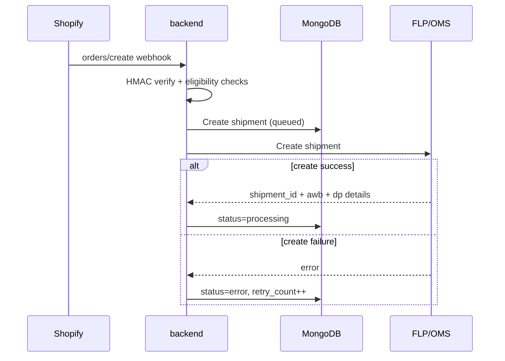
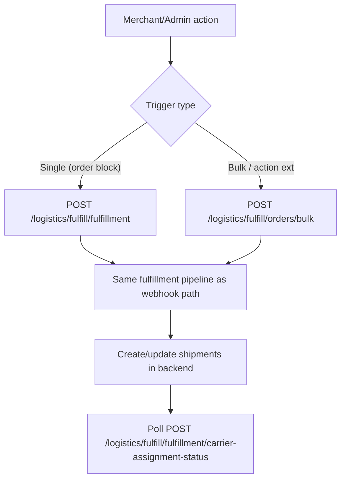
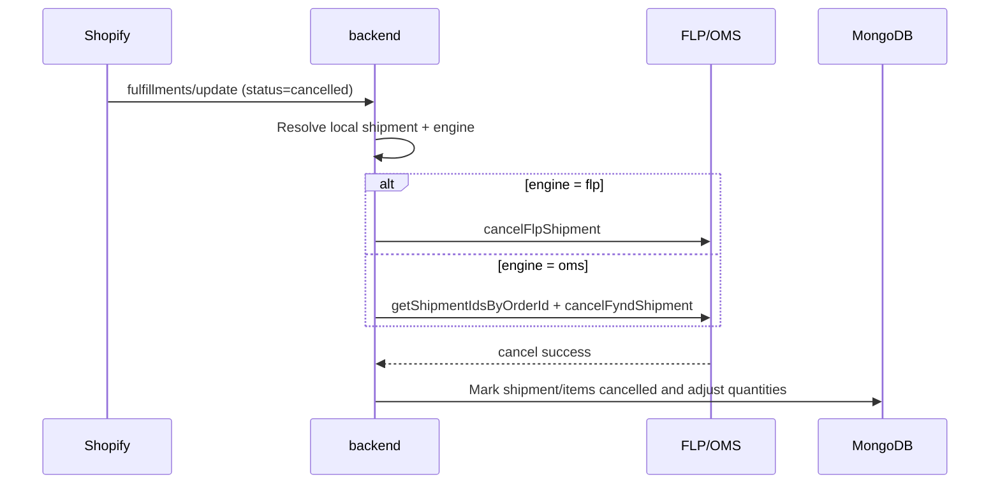
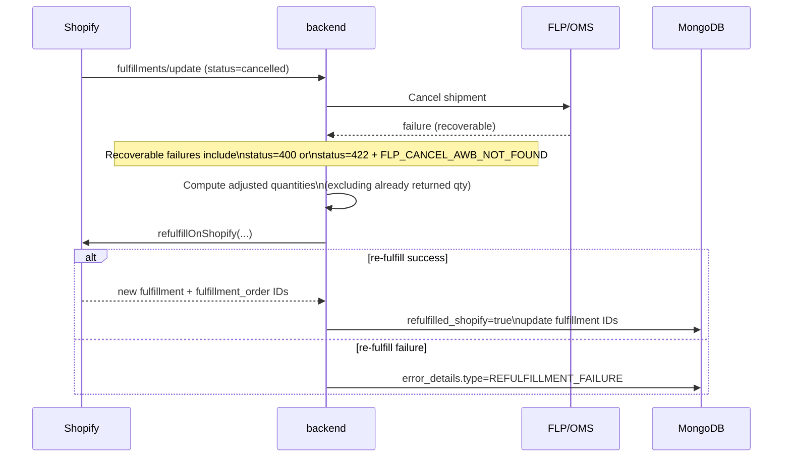

# How To: Fulfill an Order

> **Owner:** Engineering — Fynd Extensions Team
> **Status:** Approved
> **Last Updated:** 2026-06-17

---

## Automatic Fulfillment (Default)

When a customer places an order:

1. Shopify fires the `orders/create` webhook
2. `shopify-backend` receives and verifies it (HMAC check)
3. `shopifyWebhookService` checks if logistics is enabled for the shop
4. `fulfilmentService` fetches fulfillment orders from Shopify
5. For each fulfillment order, creates a shipment with FLP
6. FLP assigns a delivery partner and AWB number
7. When FLP updates shipment status → Shopify fulfillment is updated automatically

**No manual action needed** for most orders.

---

## Flow Diagram: Fulfillment Creation



---

## Manual Fulfillment (via Admin Extension)

If an order wasn't fulfilled automatically (e.g., webhook was missed, or logistics was disabled):

1. Go to **Shopify Admin → Orders** → open the order
2. Find the **Fynd Fulfillment** block (`fullfillment-extension/BlockExtension.jsx`)
3. Trigger fulfillment — the block calls `POST /logistics/fulfill/fulfillment`
4. The backend processes the fulfillment and the block polls carrier-assignment status

There is also an **order-details action** and an **order-index bulk action** (the `order-fullfilment` extension's `ActionExtension.jsx` / `OrdersIndexExtension.jsx`) that fulfill via `POST /logistics/fulfill/orders/bulk`.

> Note: `POST /logistics/fulfill/orders/:orderId` does **not** exist. Single-order fulfillment goes through `POST /logistics/fulfill/fulfillment`.

---

## Flow Diagram: Manual/Bulk Fulfillment



---

## Bulk Fulfillment (via API)

For bulk operations (order-index selection action and order-details action):

```bash
POST /logistics/fulfill/orders/bulk
Authorization: Bearer <session_token>

{
  "orderIds": ["order-id-1", "order-id-2", "order-id-3"]
}
```

---

## Fulfillment Status Reference (Admin Extension)

The order-block extension is **carrier-assignment based**. The row status the merchant sees is derived from the fulfillment-order state plus polling carrier-assignment status — not a `queued`/`processing`/`fulfilled` lifecycle.

| Extension status (`ROW_STATUS` / carrier states) | Meaning |
|---------------------------------------------------|---------|
| fulfillment-order `OPEN` | Not yet fulfilled via Fynd |
| `creating_shipment` | Fulfillment request submitted, shipment being created |
| `shipment_creation_failed` | Shipment creation failed |
| `assigning_carrier` / `carrier_assignment_pending` (`not_trackable`) | Carrier assignment in progress / not yet trackable |
| `carrier_assigned` | Carrier assigned (AWB/tracking available) |
| `carrier_assignment_failed` | Carrier assignment failed |
| `error` | Generic failure |

**FLP → Shopify failure milestones (backend-owned):**

The mapping from FLP/internal milestones to Shopify fulfillment events lives in `shopify-backend` (`utils/shopifyFulfillmentEventMap.js`, `flpWebhookHelpers.js`). For example, an internal `rto` milestone maps to a Shopify `FAILURE` event with a `statusReason` field. The detailed milestone → Shopify event table is backend-owned; see the backend docs for the authoritative mapping.

---

## Fulfillment Processing Modes (backend-owned)

> The fulfillment pipeline (sync vs. background processing, retries, and `FULFILLMENT_PROCESSING_MODE=memory-queue`) runs entirely in `shopify-backend` — it is **not** part of this app. The behavior below is backend behavior, documented here for context; treat the backend docs as the source of truth.

- **Sync mode (default):** fulfillment happens inline during the webhook request, with retry on FLP timeout.
- **Memory-queue mode** (`FULFILLMENT_PROCESSING_MODE=memory-queue`): the webhook returns immediately and fulfillment runs in a background worker.

---

## Checking Fulfillment Status

### Via Admin Extension

Open the order in Shopify Admin → see the **Fynd Fulfillment** block. The block reads fulfillment orders and polls carrier-assignment status (there is no single status endpoint).

### Via API

```bash
# 1. Read fulfillment orders + their state
GET /logistics/fulfill/orders/:orderId/fulfillment-orders
Authorization: Bearer <session_token>

# 2. Poll carrier-assignment status after a fulfillment is created
POST /logistics/fulfill/fulfillment/carrier-assignment-status
Authorization: Bearer <session_token>
```

> There is no `GET .../:orderId/fulfillment-status` endpoint. Status is derived from `fulfillment-orders` plus carrier-assignment polling.

---

## Getting Shipping Documents

Retrieve shipping labels and invoices:

```bash
POST /logistics/shipments/documents
Authorization: Bearer <session_token>

{
  "fulfillmentOrderIds": ["fo-id-1", "fo-id-2"],
  "documentType": "label"   // or "invoice"
}
```

Response includes pre-signed URLs to download PDF documents.

---

## Plan Limits (backend-owned)

> Plan/limit enforcement is implemented in `shopify-backend`, **not** in this app — the app's `/api/plan` and `/api/billing` endpoints are pass-throughs. Documented here for context only.

- Plans are **FREE** / **PAID**.
- The **FREE** plan limit is **5** fulfillments.
- When the limit is exceeded, the backend returns **HTTP 403**.
- To continue, upgrade via the Pricing page.

(The exact limit values and reset cadence are backend/billing-config values — see the backend billing config for the source of truth.)

---

## Troubleshooting Failed Fulfillments

1. Check the fulfillment-order state and carrier-assignment status:
   ```bash
   GET /logistics/fulfill/orders/:orderId/fulfillment-orders
   POST /logistics/fulfill/fulfillment/carrier-assignment-status
   ```
   Look for `shipment_creation_failed` / `carrier_assignment_failed` / `error` states.

2. Common errors:
   | Error | Cause | Fix |
   |-------|-------|-----|
   | `FLP_CREATE_FAILED` | FLP API returned error | Check FLP Platform status |
   | `LOCATION_NOT_MAPPED` | Shopify location not mapped to Fynd | Complete location setup |
   | FREE-plan limit (HTTP 403) | Free plan limit reached (backend-enforced) | Upgrade plan |
   | `LOGISTICS_DISABLED` | Logistics is disabled for shop | Enable via admin panel |

3. To retry a failed fulfillment:
   - Via Admin Extension: click "Retry" — re-invokes `POST /logistics/fulfill/fulfillment`
   - Retry re-uses the same `POST /logistics/fulfill/fulfillment` endpoint

---

## Cancellation and Re-Fulfillment Recovery

When Shopify sends `fulfillments/update` with `status=cancelled`, backend attempts to cancel the corresponding shipment on Fynd.

### Flow Diagram: Cancellation Success Path



### Flow Diagram: Cancellation Failed -> Shopify Re-Fulfill



### Recovery Notes

- Re-fulfillment is attempted only for recoverable cancellation failures.
- Quantities are adjusted before re-fulfillment to avoid over-fulfilling items already returned.
- If all items are fully returned, re-fulfillment is skipped.
- On successful re-fulfillment, shipment is marked `refulfilled_shopify=true`.
- On re-fulfillment failure, structured `error_details` is stored for debugging.
