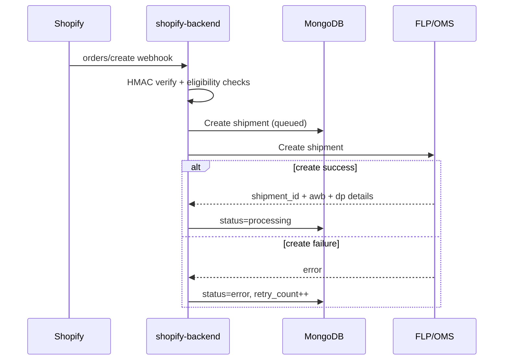
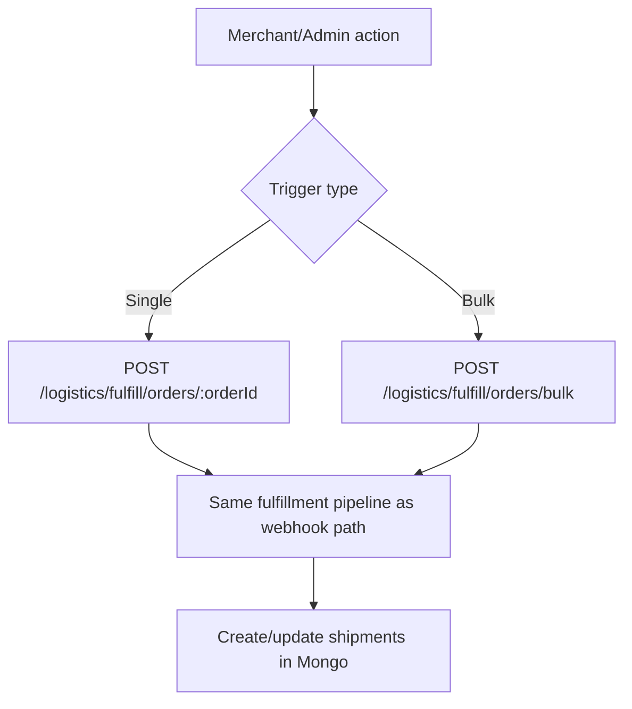
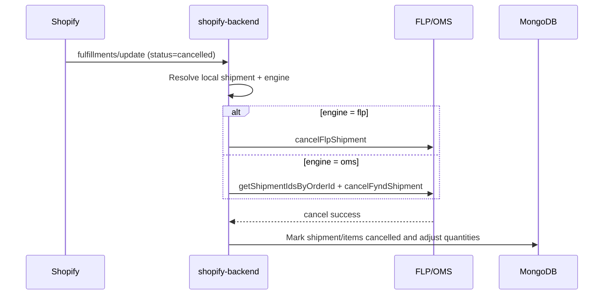
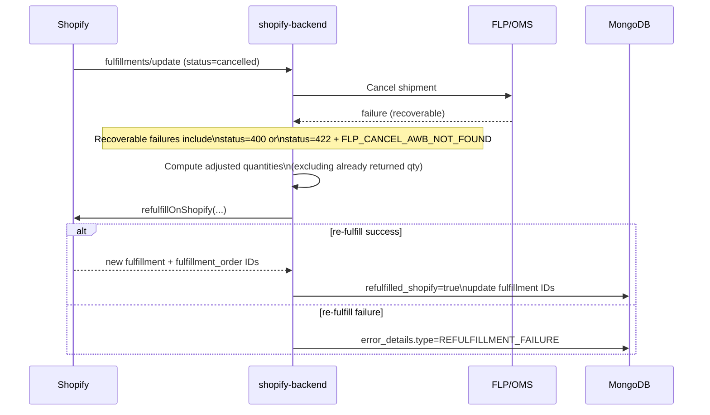

# How To: Fulfill an Order

> **Owner:** Engineering — Fynd Extensions Team
> **Status:** Approved
> **Last Updated:** 2026-03-23

---

## Automatic Fulfillment (Default)

When a customer places an order:

1. Shopify fires the `orders/create` webhook
2. `shopify-backend` receives and verifies it (HMAC check)
3. `shopifyWebhookService` checks if logistics is enabled for the shop
4. `fulfilmentService` fetches fulfillment orders from Shopify
5. For each fulfillment order, creates a shipment with FLP
6. FLP assigns a delivery partner and AWB number
7. When FLP updates shipment status → Shopify fulfillment is updated automatically

**No manual action needed** for most orders.

---

## Flow Diagram: Fulfillment Creation



---

## Manual Fulfillment (via Admin Extension)

If an order wasn't fulfilled automatically (e.g., webhook was missed, or logistics was disabled):

1. Go to **Shopify Admin → Orders** → open the order
2. Find the **Fynd Fulfillment** block
3. Click **Fulfill Order** button
4. The backend will process the fulfillment immediately

---

## Flow Diagram: Manual/Bulk Fulfillment



---

## Bulk Fulfillment (via API)

For bulk operations (useful for ops/admin scenarios):

```bash
POST /logistics/fulfill/orders/bulk
Authorization: Bearer <session_token>

{
  "orderIds": ["order-id-1", "order-id-2", "order-id-3"]
}
```

---

## Fulfillment Status Reference

| Status | Meaning |
|--------|---------|
| `queued` | Order received, fulfillment queued |
| `processing` | Shipment created with FLP, awaiting pickup |
| `fulfilled` | Delivered to customer |
| `error` | Fulfillment failed — see error_details in shipment |
| `cancelled` | Order or fulfillment was cancelled |

**FLP → Shopify status mapping:**

| FLP Status | Shopify Shows |
|-----------|--------------|
| `bag_picked` | In transit |
| `out_for_delivery` | In transit |
| `delivered` | Fulfilled |
| `rto_initiated` | Failed |
| `cancelled` | Cancelled |

---

## Fulfillment Processing Modes

The backend supports two modes:

### Sync Mode (default)

- Fulfillment happens inline during the webhook request
- If FLP call times out (default 60s), the order is retried up to 3 times
- Retries use exponential backoff (1s → 2s → 4s)

### Memory Queue Mode

Enable with: `FULFILLMENT_PROCESSING_MODE=memory-queue`

- Webhook returns immediately; fulfillment happens in background worker thread
- Better for high-order-volume stores
- Jobs have: state tracking, retry logic, graceful shutdown

---

## Checking Fulfillment Status

### Via Admin Extension

Open the order in Shopify Admin → see the **Fynd Fulfillment** block.

### Via API

```bash
GET /logistics/fulfill/orders/:orderId/fulfillment-status
Authorization: Bearer <session_token>
```

Response:
```json
{
  "fulfillmentOrderId": "fo-123",
  "status": "fulfilled",
  "fyndShipmentId": "FY-SHIP-456",
  "awbNo": "1234567890",
  "dpName": "Delhivery",
  "trackingUrl": "https://track.delhivery.com/..."
}
```

---

## Getting Shipping Documents

Retrieve shipping labels and invoices:

```bash
POST /logistics/shipments/documents
Authorization: Bearer <session_token>

{
  "fulfillmentOrderIds": ["fo-id-1", "fo-id-2"],
  "documentType": "label"   // or "invoice"
}
```

Response includes pre-signed URLs to download PDF documents.

---

## Free Plan Limits

If you're on the **Free plan**:
- Maximum **50 fulfillments per month**
- After 50, the API returns `HTTP 402` with `LIMIT_EXCEEDED`
- To continue, upgrade to Growth plan via the Pricing page

The limit resets at the start of each billing cycle (every 7 days per billing cron).

---

## Troubleshooting Failed Fulfillments

1. Check the shipment record:
   ```bash
   GET /logistics/fulfill/orders/:orderId/status
   ```
   Look at `error_details` field.

2. Common errors:
   | Error | Cause | Fix |
   |-------|-------|-----|
   | `FLP_CREATE_FAILED` | FLP API returned error | Check FLP Platform status |
   | `LOCATION_NOT_MAPPED` | Shopify location not mapped to Fynd | Complete location setup |
   | `LIMIT_EXCEEDED` | Free plan limit reached | Upgrade plan |
   | `LOGISTICS_DISABLED` | Logistics is disabled for shop | Enable via admin panel |

3. To retry a failed fulfillment:
   - Via Admin Extension: click "Retry" button
   - Via API: `POST /logistics/fulfill/orders/:orderId` (re-triggers fulfillment)

---

## Cancellation and Re-Fulfillment Recovery

When Shopify sends `fulfillments/update` with `status=cancelled`, backend attempts to cancel the corresponding shipment on Fynd.

### Flow Diagram: Cancellation Success Path



### Flow Diagram: Cancellation Failed -> Shopify Re-Fulfill



### Recovery Notes

- Re-fulfillment is attempted only for recoverable cancellation failures.
- Quantities are adjusted before re-fulfillment to avoid over-fulfilling items already returned.
- If all items are fully returned, re-fulfillment is skipped.
- On successful re-fulfillment, shipment is marked `refulfilled_shopify=true`.
- On re-fulfillment failure, structured `error_details` is stored for debugging.
