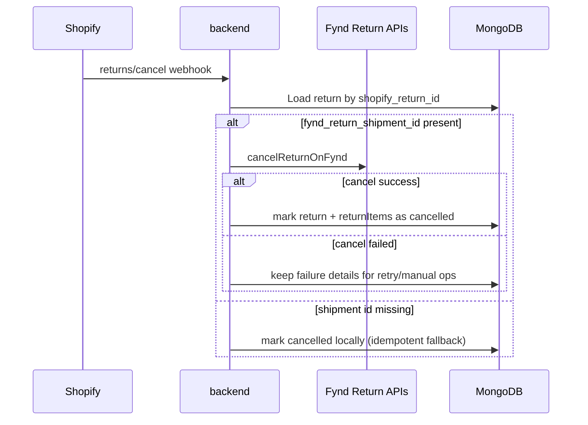

# How To: Handle Returns

> **Owner:** Engineering — Fynd Extensions Team
> **Status:** Approved
> **Last Updated:** 2026-06-17

---

## Overview

Returns are managed through the **Fynd Returns** Admin UI Extension, visible on Shopify order detail pages.

---

## Checking Return Eligibility

Before initiating a return, check if the order is eligible:

```bash
GET /logistics/orders/:orderId/fulfillments/return-eligibility
Authorization: Bearer <session_token>
```

Response:
```json
{
  "eligible": true,
  "fulfillments": [
    {
      "fulfillmentOrderId": "fo-123",
      "eligible": true,
      "items": [
        { "lineItemId": "li-1", "sku": "SKU123", "quantity": 2, "returnableQty": 2 }
      ]
    }
  ],
  "ineligibilityReason": null
}
```

Common ineligibility reasons:
- Order not yet delivered
- Return window expired (e.g., >7 days after delivery)
- Items already returned

---

## Creating a Return

### Via Admin Extension

1. Open the order in **Shopify Admin → Orders**
2. Find the **Fynd Returns** block
3. Select items to return (can be partial)
4. Select return reason
5. Click **Initiate Return**

### Via API

```bash
POST /logistics/returns
Authorization: Bearer <session_token>
```

The request body is built by `ReturnBlockExtension.jsx` from the per-fulfillment `returnQuantities` state, so a single call can create **multiple** returns across fulfillments. The response carries success/failed counts rather than a single return object — it is **not** a single-item `{ shop, orderId, fulfillmentOrderId, reason, items }` body.

Return reasons are an enum (e.g. `SIZE_TOO_SMALL`, `SIZE_TOO_LARGE`, `UNWANTED`, `DEFECTIVE`, `WRONG_ITEM`, `NOT_AS_DESCRIBED`, `UNKNOWN`).

After creating a return, the extension polls carrier-assignment status:

```bash
POST /logistics/returns/carrier-assignment-status
Authorization: Bearer <session_token>
```

---

## Return Status (Admin Extension)

The extension is carrier-assignment based. The row statuses (`ReturnBlockExtension.jsx` `ROW_STATUS`) are:

| Extension status | Meaning |
|------------------|---------|
| `creating_return` | Return request submitted, being created |
| `return_creation_failed` | Return creation failed |
| `assigning_carrier` / `carrier_assignment_pending` (`not_trackable`) | Carrier assignment in progress |
| `carrier_assigned` | Carrier assigned for pickup |
| `carrier_assignment_failed` | Carrier assignment failed |

> The persisted return lifecycle (status `initiated`/`processing`/`completed`/`failed`/`cancelled`, and `source` `merchant_initiated`/`customer_requested_approved`) is **backend-owned** — it lives in the MongoDB `returns` schema in `shopify-backend`. See the backend `database-schemas.md`. The extension status above reflects the in-UI creation + carrier-assignment flow, which is distinct from the persisted lifecycle.

---

## Customer-Requested Returns

Returns are not only merchant-initiated. Four GraphQL return webhooks are registered on install (`fyndIntegration.js`), all with the `?app=fynd-logistics` suffix:

- `returns/request` — customer requested a return
- `returns/approve` — return request approved
- `returns/decline` — return request declined
- `returns/cancel` — return cancelled

The backend reconciles these against the persisted `returns` records (e.g. `source = customer_requested_approved`).

---

## Return Cancellation

Returns can be cancelled if they haven't been picked up yet:

The `returns/cancel` Shopify webhook triggers automatically when a return is cancelled via Shopify Admin.

The webhook is registered as a **GraphQL subscription webhook** (not REST):
```
POST /webhook/store/{shop}/returns/cancel?app=fynd-logistics
```

### Return Cancellation Flow



---

## MongoDB Return Record (backend-owned)

Returns are persisted by `shopify-backend` in the `returns` collection. The schema (including the `status` enum `initiated` / `processing` / `completed` / `failed` / `cancelled` and the `source` enum `merchant_initiated` / `customer_requested_approved`) is owned by the backend — see `database-schemas.md` for the authoritative definition.

```json
{
  "shop": "my-store.myshopify.com",
  "shopify_order_id": "order-123",
  "fynd_return_id": "FY-RET-789",
  "status": "processing",
  "source": "merchant_initiated"
}
```
