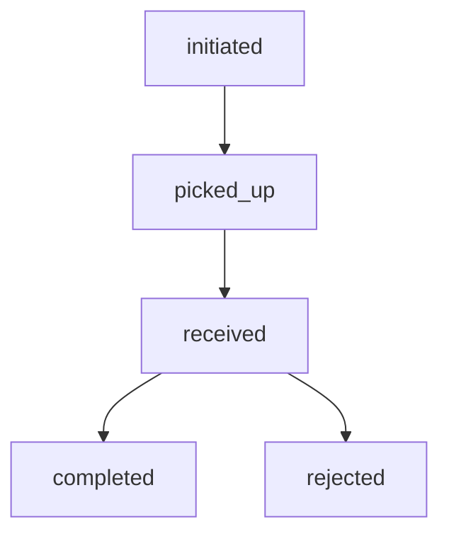
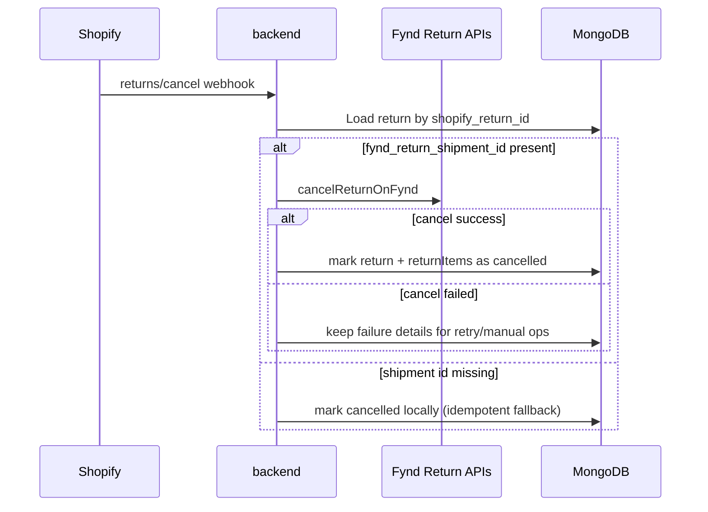

# How To: Handle Returns

> **Owner:** Engineering — Fynd Extensions Team
> **Status:** Approved
> **Last Updated:** 2026-03-23

---

## Overview

Returns are managed through the **Fynd Returns** Admin UI Extension, visible on Shopify order detail pages.

---

## Checking Return Eligibility

Before initiating a return, check if the order is eligible:

```bash
GET /logistics/orders/:orderId/fulfillments/return-eligibility
Authorization: Bearer <session_token>
```

Response:
```json
{
  "eligible": true,
  "fulfillments": [
    {
      "fulfillmentOrderId": "fo-123",
      "eligible": true,
      "items": [
        { "lineItemId": "li-1", "sku": "SKU123", "quantity": 2, "returnableQty": 2 }
      ]
    }
  ],
  "ineligibilityReason": null
}
```

Common ineligibility reasons:
- Order not yet delivered
- Return window expired (e.g., >7 days after delivery)
- Items already returned

---

## Creating a Return

### Via Admin Extension

1. Open the order in **Shopify Admin → Orders**
2. Find the **Fynd Returns** block
3. Select items to return (can be partial)
4. Select return reason
5. Click **Initiate Return**

### Via API

```bash
POST /logistics/returns
Authorization: Bearer <session_token>

{
  "shop": "my-store.myshopify.com",
  "orderId": "shopify-order-id",
  "fulfillmentOrderId": "fo-id",
  "reason": "damaged",
  "items": [
    { "lineItemId": "li-1", "quantity": 1 }
  ]
}
```

Response:
```json
{
  "success": true,
  "data": {
    "returnId": "RETURN-456",
    "fyndReturnId": "FY-RET-789",
    "status": "initiated",
    "pickupDate": "2026-03-25"
  }
}
```

---

## Return Status Flow



---

## Return Cancellation

Returns can be cancelled if they haven't been picked up yet:

The `returns/cancel` Shopify webhook triggers automatically when a return is cancelled via Shopify Admin.

The webhook is registered as a **GraphQL subscription webhook** (not REST):
```
POST /webhook/store/{shop}/returns/cancel?app=fynd-logistics
```

### Return Cancellation Flow



---

## MongoDB Return Record

Returns are stored in the `returns` collection:

```json
{
  "shop": "my-store.myshopify.com",
  "shopify_order_id": "order-123",
  "fulfillment_order_id": "fo-456",
  "fynd_return_id": "FY-RET-789",
  "status": "picked_up",
  "reason": "damaged",
  "items": [{ "lineItemId": "li-1", "quantity": 1 }]
}
```
