# Incident Response

> **Owner:** Engineering — Fynd Extensions Team
> **Status:** Approved
> **Last Updated:** 2026-03-23

---

## Severity Levels

| Level | Description | Response Time |
|-------|-------------|--------------|
| P1 | Production down, all merchants affected | Immediate |
| P2 | Major feature broken (fulfillment/billing/webhooks broadly failing) | < 1 hour |
| P3 | Feature degraded or partially failing | < 4 hours |
| P4 | Minor issue with workaround | Next sprint |

---

## Triage Flow

```mermaid
flowchart TD
    A[Alert triggered: Sentry/PagerDuty/merchant report] --> B{Production impact?}
    B -- Yes --> C{All or most merchants impacted?}
    C -- Yes --> D[Classify P1]
    C -- No --> E[Classify P2]
    B -- No --> F{Functional degradation?}
    F -- Yes --> G[Classify P3]
    F -- No --> H[Classify P4]

    D --> I[Create incident channel + assign commander]
    E --> I
    G --> J[Assign owner + start runbook]
    H --> K[Create backlog ticket]

    I --> L[Run service-specific diagnosis]
    J --> L
    L --> M[Mitigate first]
    M --> N[Restore service]
    N --> O[Post-incident review + prevention tasks]
```



---

## Common Incidents and Runbooks

### Fulfillments Not Processing

Symptoms:
- Orders created in Shopify but not moving in Fynd
- `shipments.status` stuck at `queued`
- Errors around FLP shipment creation

Investigation:
```bash
curl https://shopify-backend.extensions.fynd.com/_healthz

db.shipments.find({
  status: "queued",
  createdAt: { $lt: new Date(Date.now() - 10*60000) }
})

db.stores.findOne({ shop: "affected-store.myshopify.com" }, { logistics_status: 1 })
```

Fix:
- If FLP is down: hold and retry after FLP recovery
- If `logistics_status` is disabled: re-enable from admin flow
- If queue is stale: trigger controlled manual fulfillment

---

### Webhooks Not Being Received

Symptoms:
- New orders in Shopify but no matching processing in backend
- Missing webhook handler logs

Investigation:
```bash
# Verify webhook delivery in Shopify Partners dashboard
# Verify shop registration + webhook bootstrap state in DB

db.stores.findOne({ shop: "affected.myshopify.com" })
```

Fix:
- Re-run install/bootstrap flow for affected shop
- Confirm public callback URL/HOST values are correct

---

### Billing Cron Not Running

Symptoms:
- `billingCycleEnd` in past but no usage records
- Billing drift reports from merchants

Investigation:
```bash
kubectl logs -n ext -l job-name=shopify-backend-billing-cron --previous

db.subscriptions.find({
  status: "active",
  billingCycleEnd: { $lt: new Date() }
})
```

Fix:
- Trigger billing manually via `GET /config/billingCron`
- Run cron process with `MODE=cron CRON_JOB=billing_trigger node server.js`

---

### MongoDB Connection Issues

Symptoms:
- Widespread 5xx errors
- `MongoNetworkError` or connection timeout spikes

Fix:
- Check Mongo cluster health
- Validate connection strings and secret injection
- Restart impacted deployments if pools are broken:
  `kubectl rollout restart deployment shopify-backend`

---

## Escalation Path

1. On-call engineer
2. Team lead
3. Platform infrastructure team (Kubernetes/Mongo/Redis)
4. Fynd platform team (FLP/Central/extension APIs)
5. Shopify partner support (Shopify platform issues)

---

## Post-Incident Process

After each P1/P2:
1. Publish a short post-mortem (timeline, root cause, impact, mitigation).
2. Create prevention tickets with owner + due date.
3. Add/adjust alerts for earlier detection.
4. Update this runbook with any new incident pattern.
