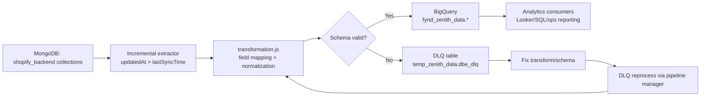

# Data Pipeline Overview

> **Owner:** Engineering — Fynd Extensions Team
> **Status:** Approved
> **Last Updated:** 2026-06-17

How `shopify-backend` MongoDB data is expected to sync to BigQuery for analytics.

> **Current verification note:** The checked-out `transformations` repository does not currently contain `transformations/shopify/mongo/shopify_backend/*` or any `shopify_backend` transformation files. Treat the collection-level mapping below as historical/target documentation until the transformation project is restored or confirmed in another repository/branch.

---

## End-to-End Pipeline Diagram



---

## Pipeline Technology Stack

| Component | Technology |
|-----------|-----------|
| Source | MongoDB (Zenith read replica) |
| Transformation | Node.js JavaScript scripts |
| Orchestrator | Boltic |
| Destination | Google BigQuery |
| Management | `cli_pipeline_manager.js` |
| Failure sink | BigQuery DLQ |

---

## Sync Strategy

Type: incremental sync using `updatedAt` cursor per collection.

```javascript
// Historical/target path:
// transformations/shopify/incremental-columns.js
{
  'mongo.shopify_backend.stores': 'updatedAt',
  'mongo.shopify_backend.orders': 'updatedAt',
  'mongo.shopify_backend.subscriptions': 'updatedAt',
  'mongo.shopify_backend.productMappings': 'updatedAt',
  'mongo.shopify_backend.storeMappings': 'updatedAt',
  'mongo.shopify_backend.courierPartners': 'updatedAt'
}
```

Per run:
1. Read rows where `updatedAt > lastSyncTime`
2. Transform rows to destination schema
3. Upsert into BigQuery using `__boltic_primary_key_columns`
4. Advance sync cursor

---

## Collection Coverage

Previously documented / target sync set:
- `stores`
- `orders`
- `subscriptions`
- `productMappings`
- `storeMappings`
- `courierPartners`

Known MongoDB collections not covered by the previously documented sync set:
- `shipments`
- `returns`
- `logistics`
- `logisticsOrders`
- `logisticsDeliveryPartners`
- `productAccounts`

Details: [Collections Synced](./collections-synced.md)

---

## Transformation Contract

Expected collection path:

```text
transformations/shopify/mongo/shopify_backend/<collection>/
├── transformation.js
└── destination-schemas.json
```

Expected `transformRows` output:
- `data`: transformed row array
- `__boltic_primary_key_columns`: upsert key(s)
- `__boltic_partition_columns`: partition field(s)

---

## Data Quality Guards

- Safe date parsing with valid timestamp range checks
- Safe JSON serialization for nested Mongo documents
- Null fallback for malformed or out-of-range values

---

## DLQ Operations

Use DLQ for schema/transform failures.

```sql
SELECT *
FROM `fynd-jio-commerceml-prod.temp_zenith_data.dbe_dlq`
WHERE dataset = 'shopify_backend'
ORDER BY created_at DESC
LIMIT 100
```

Recovery loop:
1. Inspect failed payload + error
2. Fix transformation/schema
3. Reprocess DLQ from pipeline manager

---

## Environments

| Stage | Dataset/Project |
|------|------------------|
| Non-prod | Stage-specific test dataset |
| Production | `fynd-jio-commerceml-prod.fynd_zenith_data` |

---

## Ownership Boundaries

- Source schema ownership: `shopify-backend`
- Transform/schema ownership: `transformations`, but current `shopify_backend` transform location needs confirmation
- Runtime orchestration ownership: Boltic pipeline operators
- Analytics consumption ownership: reporting/data consumers
